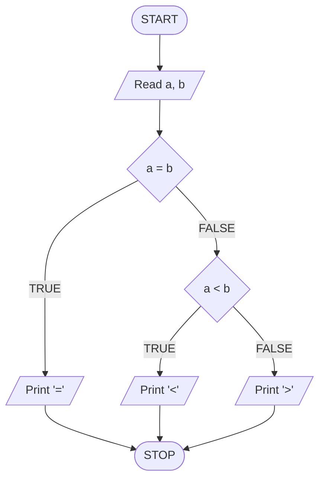

# Block diagram

```mermaid
flowchart TD
    START([START]) --> K1[/Read a, b/]
    K1 --> K2{a = b}
    K2 -- TRUE --> K3[/Print '='/]
    K2 -- FALSE --> K4{a < b}
    K4 -- TRUE --> K5[/Print '<'/]
    K4 -- FALSE --> K7[/Print '>'/]
    K3 --> STOP([STOP])
    K5 --> STOP
    K7 --> STOP 
```
