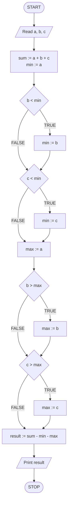

# Block diagram

```mermaid
flowchart TD
    START([START]) --> K1[/Read a, b, c/]
    K1 --> K2[sum := a + b + c\nmin := a]
    K2 --> K4{b < min}
    K4 -- TRUE --> K5[min := b]
    K4 -- FALSE --> K6{c < min}
    K5 --> K6
    K6 -- TRUE --> K7[min := c]
    K6 -- FALSE --> K8[max := a]
    K7 --> K8
    K8 --> K9{b > max}
    K9 -- TRUE --> K10[max := b]
    K9 -- FALSE --> K11{c > max}
    K10 --> K11
    K11 -- TRUE --> K12[max := c]
    K11 -- FALSE --> K13[result := sum - min - max]
    K12 --> K13
    K13 --> K14[/Print result/]
    K14 --> STOP([STOP])
```
