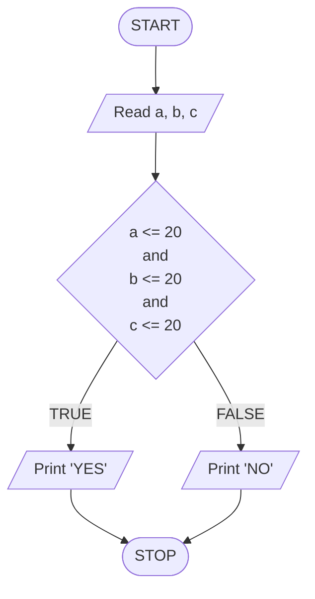

# Block diagram

```mermaid
flowchart TD
    START([START]) --> K1[/Read a, b, c/]
    K1 --> K2{a <= 20\nand\nb <= 20\nand\nc <= 20}
    K2 -- TRUE --> K3[/Print 'YES'/]
    K2 -- FALSE --> K5[/Print 'NO'/]
    K3 --> STOP([STOP])
    K5 --> STOP
```
