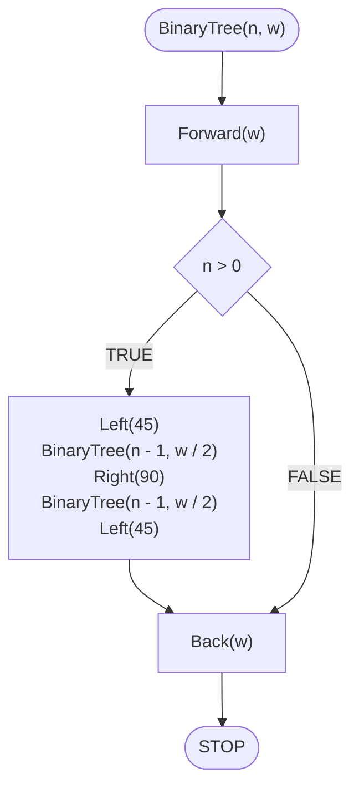

# Drzewo binarne

## Opis problemu

TODO

### Specyfikacja

#### Dane

* $$n$$ - stopień drzewa binarnego
* $$w$$ - początkowa długość gałęzi (pnia)

#### Wynik

* Drzewo binarne stopnia $$n$$ i początkowej długości $$w$$.

### Prezentacja


Drzewo binarne - wprowadzenie


## Rozwiązanie

### Prezentacja


Drzewo binarne - algorytm


### Pseudokod

```
function BinaryTree(n, w):
    1. Forward(w)
    2. If n > 0, then:
        3. Left(45)
        4. BinaryTree(n - 1, w / 2)
        5. Right(90)
        6. BinaryTree(n - 1, w / 2)
        7. Left(45)
    8. Back(w)
```

### Block diagram



## Implementacja

### C++


[binary-tree.md](../../programming/c++/algorithms/fractals/binary-tree.md)


### Python


[binary-tree.md](../../programming/python/algorithms/fractals/binary-tree.md)


### Blockly


[binary-tree.md](../../programming/blockly/algorithms/fractals/binary-tree.md)

