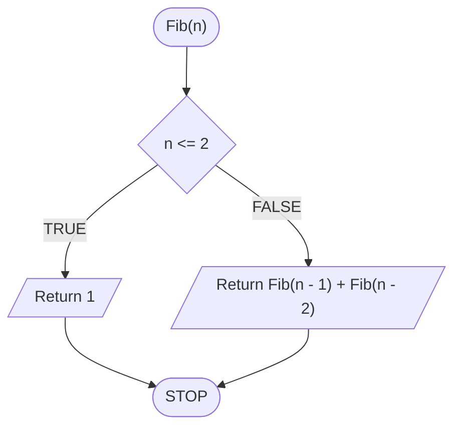
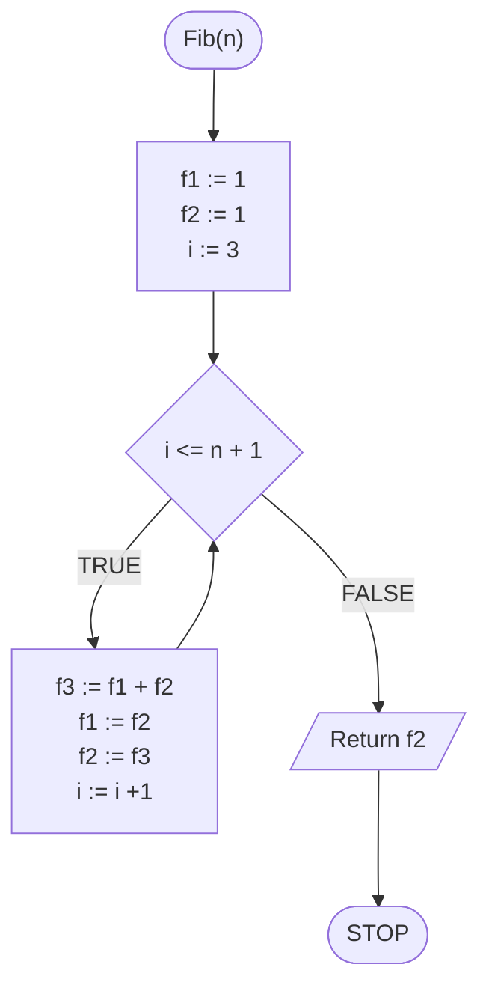

# Liczby Fibonacciego

## Opis problemu

TODO

### Specyfikacja

#### Dane

* $$n$$ - liczba naturalna, większa od zera

#### Wynik

* $$n$$-ta liczba Fibonacciego

### Przykład

#### Dane

```
n := 10
```

**Wynik**: $$55$$ 


**Wyjaśnienie**

Pierwszych kolejnych dziesięć liczb Fibonacciego to: $$1, 1, 2, 3, 5, 8, 13, 21, 34, 55$$ 


## Rozwiązanie rekurencyjne

### Pseudokod

```
function Fib(n):
    1. If n <= 2, then:
        2. Return 1
    3. Return Fib(n - 1) + Fib(n - 2)
```

### Schemat blokowy



## Rozwiązanie iteracyjne

### Pseudokod

```
function Fib(n):
    1. f1 := 1
    2. f2 := 1
    3. From i := 3 to n + 1, do:
        4. f3 := f1 + f2
        5. f1 := f2
        6. f2 := f3
    7. Return f2
```

### Schemat blokowy



## Implementacja

### C++


[fibonacci-numbers.md](../../programming/c++/algorithms/integers/fibonacci-numbers.md)


### Python


[fibonacci-numbers.md](../../programming/python/algorithms/integers/fibonacci-numbers.md)

