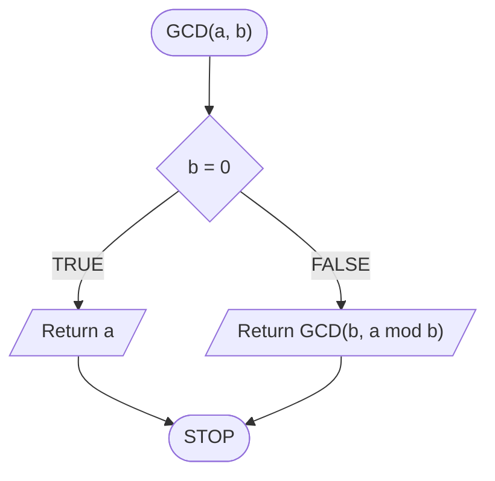

# Euclid's algorithm

## Problem description

### Specification

#### Input

* $$a, b$$ — natural numbers, $$a>0$$, $$b>0$$

#### Output

* $$GCD(a, b)$$ — greatest common divisor of numbers $$a$$ and $$b$$ 

### Example

#### Input

```
a := 32
b := 12
```

**Output**: $$4$$ 


**Explanation**

Divisors of the number $$32$$: $$1, 2, 4, 8, 16, 32$$

Divisors of the number $$12$$: $$1, 2, 3, 4, 6, 12$$

Common divisors: $$1, 2, 4$$ 

The greatest of them is $$4$$.


## Subtraction method

### Pseudocode

```
function GCD(a, b):
    1. While a != b, do:
        2. If a > b, then:
            3. a := a - b
        4. else:
            5. b := b - a
    6. Return a
```

### Block diagram


## Iterative modulo method

### Pseudocode

```
function GCD(a, b):
    1. While b != 0, do:
        2. b2 := b
        3. b := a mod b
        4. a := b2
    5. Return a
```


**mod** stands for modulo


### Block diagram


## Recursive modulo method

### Pseudocode

```
function GCD(a, b):
    1. If b = 0, then:
        2. Return a
    3. Return GCD(b, a mod b)
```

### Block diagram



## Implementation

### C++


[gcd.md](../../programming/c++/algorithms/integers/gcd.md)


### Python


[gcd.md](../../programming/python/algorithms/integers/gcd.md)


### Blockly


[gcd.md](../../programming/blockly/algorithms/integers/gcd.md)


