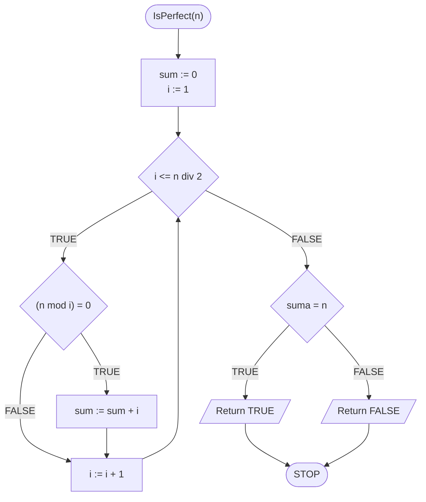
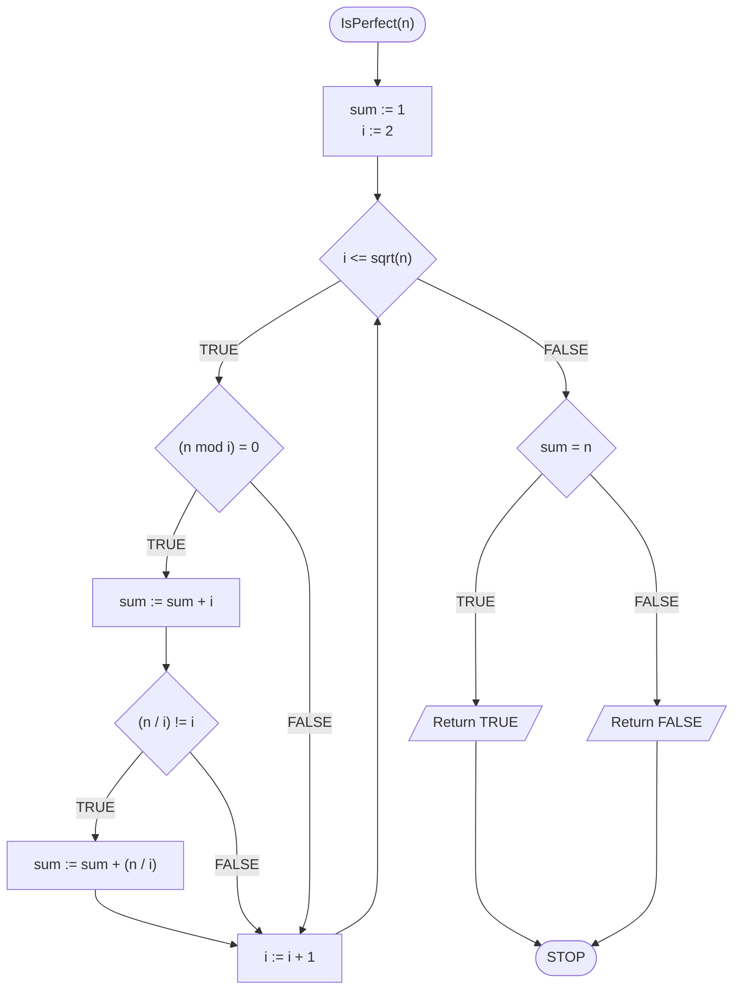

# Test doskonałości

## Opis problemu

Czym jest liczba doskonała? Zacznijmy od dwóch definicji.


#### Liczba doskonała

Liczba doskonała to taka, która jest równa sumie wszystkich swoich **dzielników właściwych**.



**Dzielnik właściwy**

Dzielnik liczby **różny** od niej samej.


Podobnie jak w przypadku testu pierwszości, problem doskonałości liczby jest podobny do problemu znalezienia wszystkich dzielników liczby, opisanego tutaj: [Wszystkie dzielniki](divisors.md)

Zaczynamy od formalnej specyfikacji i przykładu.

### Specyfikacja

#### Dane:

* $$n$$ - liczba naturalna

#### Wynik:

* **PRAWDA **- jeżeli $$n$$ jest liczbą doskonałą
* **FAŁSZ **- jeżeli $$n$$ nie jest liczbą doskonałą

### Przykład 1

#### Dane

```
n := 6
```

**Wynik**: PRAWDA


#### Wyjaśnienie

Dzielnikami właściwymi liczby $$6$$ są: $$1, 2, 3$$ 

Po ich zsumowaniu otrzymamy z powrotem liczbę $$6$$:

$$6=1+2+3$$ 


### Przykład 2

#### Dane

```
n := 8
```

**Wynik**: FAŁSZ


#### Wyjaśnienie

Dzielnikami właściwymi liczby 8 są: $$1, 2,4$$ 

Po ich zsumowaniu otrzymamy liczbę $$7$$:

$$8\not=1+2+4$$ 


## Rozwiązanie naiwne

Tym razem pominiemy rozwiązanie zupełnie naiwne i zaczniemy od naiwnego. Będziemy więc przechodzić przez kolejne wartości od $$1$$ do połowy naszej liczby. Tym razem nie chcemy ich wypisywać, tylko zsumować. Potrzebna więc nam będzie dodatkowa zmienna, do której będziemy dodawać kolejne dzielniki. Oczywiście taką zmienną musimy utworzyć **przed pętlą**. Jaką wartość początkową należy jej nadać? Jak to zwykle bywa, sumowanie zaczynamy od zera.

W pętli, gdy znajdziemy kolejny dzielnik, to dodajemy go do sumy. Na końcu, gdy już zsumujemy wszystkie dzielniki, czyli po wyjściu z pętli, należy sprawdzić, jaki wynik powinniśmy zwrócić. W tym celu porównujemy obliczoną sumę ze sprawdzaną liczbą. Jeżeli są sobie równe, to znaczy, że mamy do czynienia z liczbą doskonałą, więc zwracamy wynik PRAWDA. Jeżeli są od siebie różne, to liczba nie jest doskonała, więc zwracamy FAŁSZ.

Teraz możemy zapisać nasz algorytm.

### Pseudokod

```
function IsPerfect(n):
    1. sum := 0
    2. From i := 1 to n div 2, do:
        3. If (n mod i) = 0, then:
            4. sum := sum + i
      
    5. If suma = n, then:
        6. Return TRUE
   
    7. else:
        8. Return FALSE
```

### Block diagram



### Złożoność

$$O(\frac{n}{2})$$

## Rozwiązanie optymalne

TODO

### Pseudokod

```
function IsPerfect(n)
    1. sum := 1
    2. From i := 2 to sqrt(n), do:
        3. If (n mod i) = 0, then:
            4. sum := sum + i
            5. If (n / i) != i, then:
                6. sum := sum + (n / i)
            
    7. If suma = n, then:
        8. Return TRUE
    
    9. else:
        10. Return FALSE
```


**sqrt** oznacza pierwiastek


### Block diagram



### Złożoność

$$O(\sqrt{n})$$ 

## Implementacja

### C++


[perfect-test.md](../../programming/c++/algorithms/integers/perfect-test.md)


### Python


[perfect-test.md](../../programming/python/algorithms/integers/perfect-test.md)

