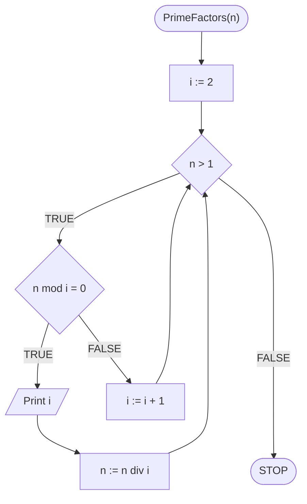

# Rozkład na czynniki pierwsze

## Opis problemu

### Specyfikacja

#### Dane

* $$n$$ - liczba naturalna, większa od zera

#### Wynik

* Rozkład liczby $$n$$ na czynniki pierwsze 

### Przykład

#### Dane

```
n := 124
```

**Wynik**: $$2, 2, 31$$ 

## Rozwiązanie

### Pseudokod

```
function PrimeFactors(n):
    1. i := 2
    2. While n > 1, do:
        3. If n mod i = 0, then:
            4. Print i
            5. n := n div i
        6. else:
            7. i := i + 1
```


**mod** oznacza resztę z dzielenia

**div** oznacza dzielenie całkowite


### Schemat blokowy



## Implementacja

### C++


[prime-factors.md](../../programming/c++/algorithms/integers/prime-factors.md)


### Python


[prime-factors.md](../../programming/python/algorithms/integers/prime-factors.md)

