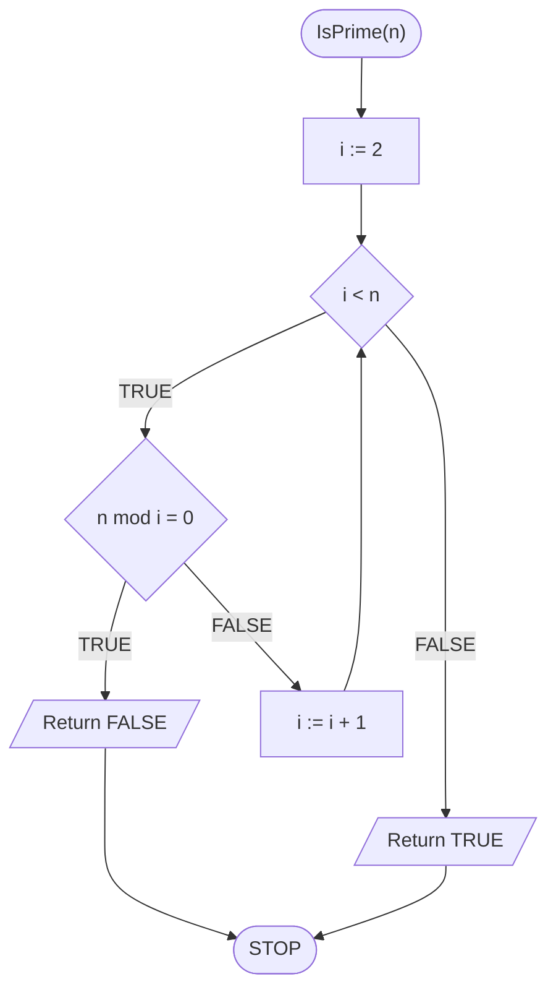
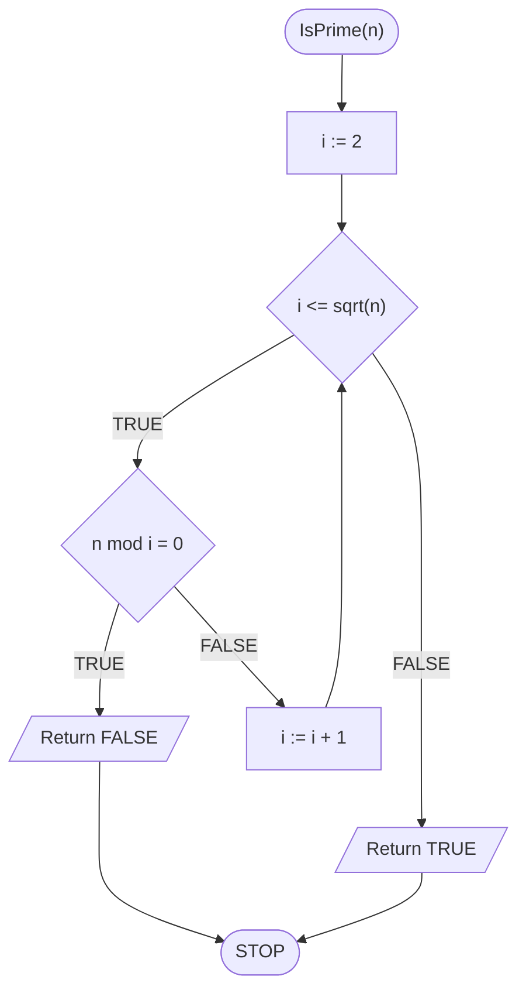

# Prime test

## Problem description

Liczby pierwsze odgrywają w matematyce i informatyce znaczącą rolę, szczególnie w kryptografii. Zacznijmy od zdefiniowania czym jest liczba pierwsza:


#### Liczba pierwsza

Liczbę naturalną, która jest podzielna wyłącznie przez $$1$$ i przez siebie samą, nazywamy **liczbą pierwszą**.


Naszym zadaniem jest sprawdzić, czy dana liczba naturalna jest liczbą pierwszą. Jednym ze sposobów jest sprawdzić, jakie dzielniki ma ta liczba. Nasze podejście do tego problemu będzie bardzo podobne jak w przypadku wypisania wszystkich dzielników liczby, dlatego warto najpierw zajrzeć do tego właśnie tematu: [Wszystkie dzielniki](divisors.md)

Jak zwykle zaczynamy od formalnej specyfikacji problemu i kilku prostych przykładów.

### Specification

#### Input:

* $$n$$ - liczba naturalna większa od $$1$$ 

#### Output:

* **PRAWDA**- jeżeli $$n$$ jest liczbą pierwszą
* **FAŁSZ**- jeżeli $$n$$ nie jest liczbą pierwszą


Dlaczego w specyfikacji wymagamy, żeby liczba $$n$$ była większa od $$1$$? Dla ułatwienia i zwiększenia czytelności rozwiązania. Wiadomo, że liczby $$0$$ i $$1$$ nie są liczbami pierwszymi. W związku z tym możemy je łatwo potraktować jako osobny przypadek, używając instrukcji warunkowej. To jednak zostawimy jako ćwiczenie do samodzielnego wykonania.


### Example 1

#### Input

```
n := 7
```

**Wynik**: PRAWDA


**Wyjaśnienie**

Dzielnikami liczby $$7$$ są $$1$$ i $$7$$, więc jest to liczba pierwsza.


### Example 2

#### Input

```
n := 8
```

**Wynik**: FAŁSZ


**Wyjaśnienie**

Dzielnikami liczby 8 są $$1,2,4$$ i $$8$$, więc nie jest to liczba pierwsza.


## Trivial solution

W pierwszym rozwiązaniu postępować będziemy podobnie, jak w przypadku wypisywania wszystkich dzielników liczby. Są jednak dwie znaczące różnice. Po pierwsze nie interesuje nas, czy liczba jest podzielna przez $$1$$ i samą siebie, ponieważ z góry wiemy, że tak jest. Możemy więc nieznacznie zawęzić obszar poszukiwań. Po drugie nie interesuje nas jakie dokładnie dzielniki ma liczba, tylko **czy** ma jakieś dzielniki, różne od $$1$$ i niej samej. W związku z tym, jak tylko znajdziemy jakiś dzielnik, możemy od razu stwierdzić, że liczba nie jest pierwsza i zwrócić właściwą wartość, czyli FAŁSZ i zakończyć obliczenia.

Jak jednak sprawdzić, że liczba jest pierwsza? To proste. Wystarczy, że nie znajdziemy żadnych dzielników. Jak nie znajdziemy dzielników, to nie zwrócimy wartości FAŁSZ, tylko wyjdziemy z pętli. Jeśli tak się stanie, to znaczy, że liczba jest pierwsza, należy więc zwrócić wartość PRAWDA.

Podsumujmy nasze rozważania w formie gotowego algorytmu.

### Pseudocode

```
function IsPrime(n):
    1. From i := 2 to n - 1, do:
        2. If (n mod i) = 0, then:
            3. Return FALSE
        
    4. Return TRUE
```


**mod** stands for the modulo operation


### Block diagram



### Complexity

$$O(n)$$ - liniowa

## Solution  naiwne

### Pseudocode

```
function IsPrime(n):
    1. From i := 2 to n div 2, do:
        2. If (n mod i) = 0, then:
            3. Return FALSE
        
    4. Return TRUE
```

### Block diagram


### Complexity

$$O(\frac{n}{2})$$ 

## Optimal solution

### Pseudocode

```
function IsPrime(n):
    1. From i := 2 to sqrt(n), do:
        2. If (n mod i) = 0, then:
            3. Return FALSE
        
    4. Return TRUE
```

### Block diagram



### Complexity

$$O(\sqrt{n})$$ 

## Implementation

### C++


[prime-test.md](../../programming/c++/algorithms/integers/prime-test.md)


### Python


[prime-test.md](../../programming/python/algorithms/integers/prime-test.md)

