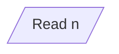
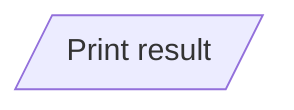
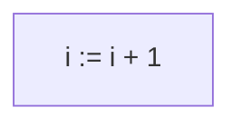
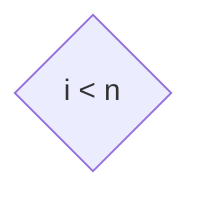
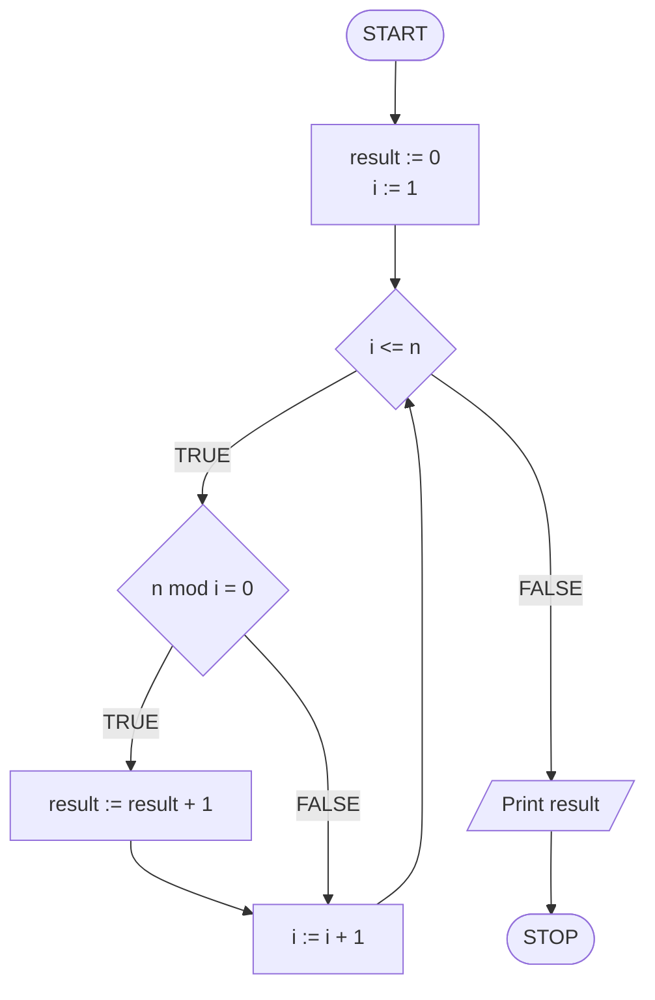

# Ways of describing algorithms

## Introduction

We already know what an algorithm is more or less. Before we go any further, let's talk for a moment about how algorithms are written. There are several of them and in our materials we will focus on the last three, i.e. **pseudocode**, **block diagram** and **implementation**, but it is also worth getting to know the others.


The algorithm discussed on this page is purely illustrative and its purpose is to show the differences between the different ways of writing the algorithm. So don't worry, if something is still unclear now, everything will be explained in the next topics :)


An important part of any algorithm, as we've defined before, is the specification. We will use an example specification, for which we will show how the same algorithm presents itself in different forms of writing.

### Specification

#### Input

* $$n$$ - natural number

#### Output

* The number of all divisors of $$n$$ 

## Verbal description

The least formal of all the methods of describing algorithms presented here. As the name suggests, we describe the algorithm in our own words, without adhering to any particular formalism. Due to this fact, this type of description can be helpful for brainstorming and solving a problem together, but usually it will not be sufficient if we want to move on to implementation. Its disadvantage may also be the lack of clarity.

### Example

Go through the numbers from $$1$$ to $$n$$ one by one ($$1,2,3,4,...$$). As you go through the consecutive numbers, count by how many of them $$n$$ is divisible, this will be the result of the algorithm.

## Steps list

A more structured way of writing compared to a verbal description, but still devoid of the usually required formalities. In a way, it is breaking down a verbal description into steps. Depending on the approach, the list of steps can be very similar to pseudocode.

### Example

```
1. Remember the result equal to 0
2. For consecutive numbers from 1 to n, do:
    3. If n is divisible by the checked number, then:
        4. Inrease the result by 1
5. Print the result
```

## Pseudocode

A pseudocode is something between a list of steps and the code in your programming language of choice. As the name suggests, this is **pseudo**-code. So we are dealing here with a provision more formal than a list of steps, but still subject to certain contractual provisions and rules. However, one agreed formalism is missing, so one can encounter numerous approaches to writing pseudocode.

### Example

```
1. result := 0
2. From i := 1 to n, do:
    3. If n mod i = 0, then:
        4. result := result + 1
5. Print result
```

## Block diagram

The block diagram is one of the most formal and unambiguous ways of writing algorithms. As the name suggests, we are dealing here with blocks that are connected with each other by means of arrows that indicate the sequence of operations. Each block has its own type and purpose, which is defined by its shape. In the basic notation, we distinguish the following blocks:

### Starting block


It all starts with it. Its role is to define the beginning of the program.

### End block: terminator


Determines the end of the computation.

### Input block



Here we load the input data. Since the input and output blocks have the same shape, for the sake of clarity, we add information that we are loading data, usually in the form of an abbreviation, e.g. input, read, in, etc.

### Output block



Here we print messages and values, or we return the result of calculations. As in the case of the input block, we add an abbreviation that defines the type of operation, for example: out, print.

### Computation block



In this block, we perform all calculations, as well as initialization and assigning values to variables.

### Conditional statement block



The only block where two arrows come out, usually left and right. To these arrows, we usually add strings like "Yes" / "No" or "True" / "False", specifying in which direction the program calculations should proceed depending on whether the condition is met or not.

### Example



## Code in a programming language

The most formal and accurate description of the algorithm is its implementation in the selected programming language.

### Example

#### C++

```cpp
#include <iostream>

using namespace std;

int main() {
    int n, result;
    
    cin >> n;
    
    result = 0;
    
    for(int i = 1; i <= n; i++) {
        if (n % i == 0) {
            result += 1;
        }
    }
    
    cout << result << endl;
    
    return 0;
}
```


Example: C++


#### Python

```python
n = int(input())

result = 0

for i in range(1, n + 1):
    if n % i == 0:
        result += 1

print(result)
```


Example: Python


#### Pascal

```pascal
program divisors;
var n, result, i: integer;
begin
	read(n);
	
	result := 0;
	
	for i:=1 to n do begin
		if n mod i = 0 then begin
			result := result + 1;
		end;
	end;
	
	writeln(result);
end.
```


Example: Pascal

