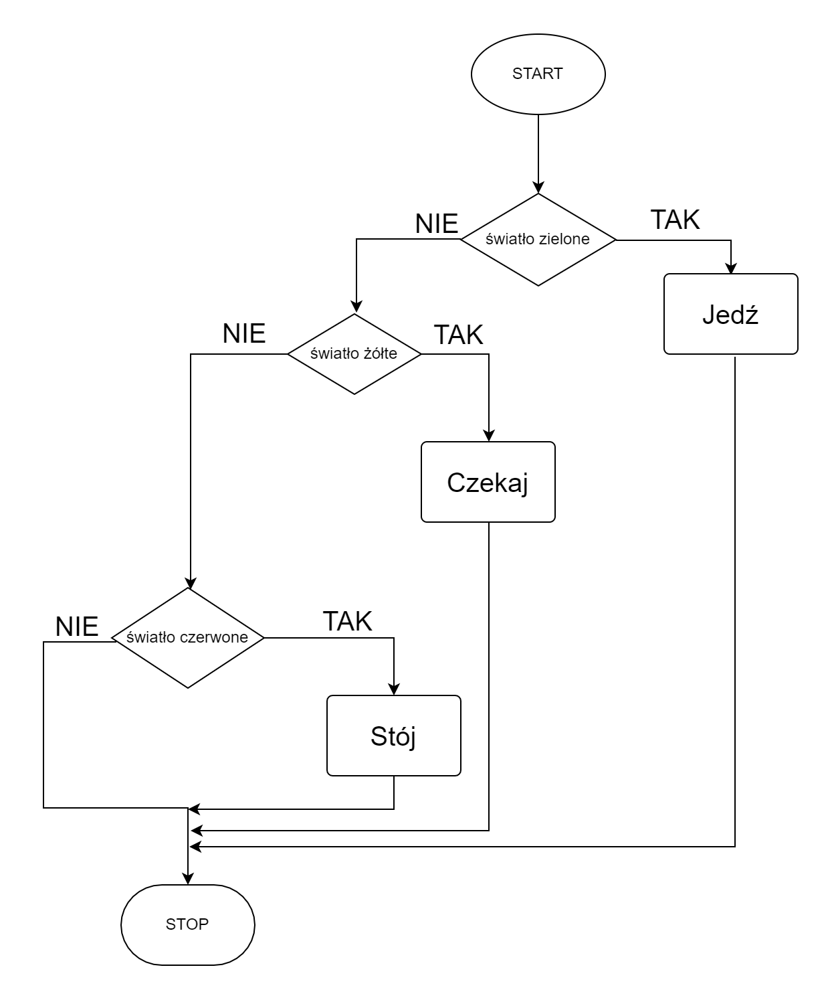
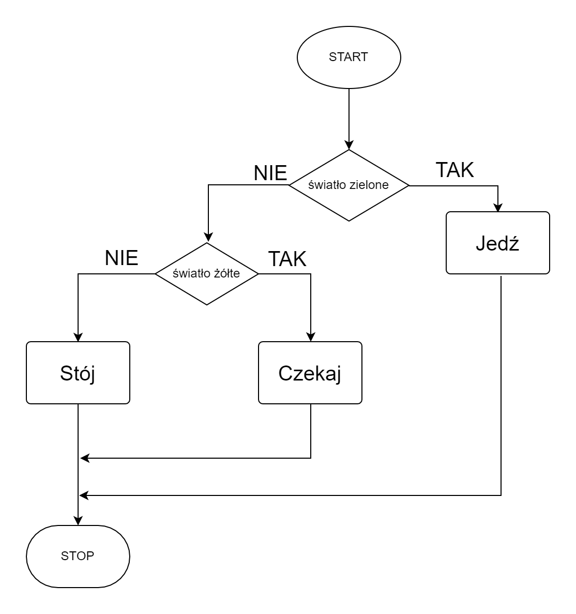
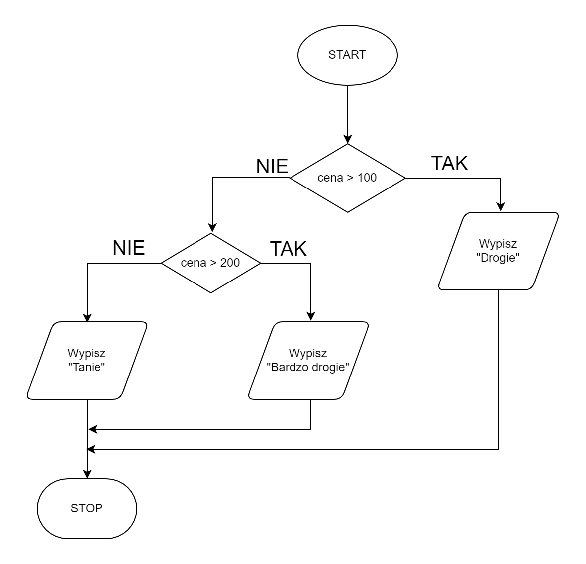
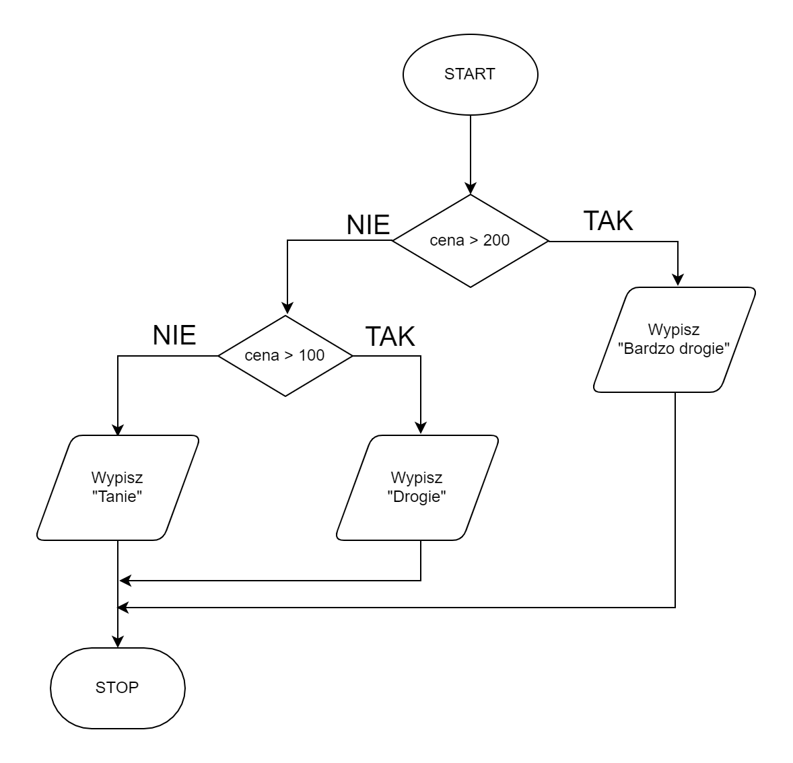

# Conditional statement

## Introduction

By using only linear algorithms we would not be able to solve many problems. Why? The design of linear algorithms is too ... linear. Sometimes we have to make different decisions depending on the situation. Imagine the problem of crossing the street. Can you construct a linear algorithm for safe crossing a pedestrian crossing? We cannot just say "cross the lanes" because there may be a car moving! You should look around first and then, **if** nothing is going, go to the other side of the street.

The key word here is: **if**. Depending on whether the cars are moving or not, we will perform various actions. If the cars are moving, we will wait. And if nothing goes, we can go. We will call such a construction a **conditional statement**.

The use of a conditional instruction means that the execution of our program may have different runs, i.e. different instructions may be executed depending on certain conditions.

## Simple conditional statement

Let's start with a simple example. Again, imagine a pedestrian crossing, but this time there are traffic lights. Everyone should know how to cross a crossing at traffic lights. Let's try to construct an algorithm for this operation.

### Example 1

First, let's consider what it looks like to pass through a traffic light. First we look at the lights and, depending on their color, either cross the street or wait. Then our decision, or the operation we perform, depends on the color of the lights. These colors can be two: green or red. So we will apply two conditional statements.

#### Steps list

```
1. If the light is green then:
    2. Go
    
3. If the light is red then:
    4. Stop
```

Note the indentation in the above notation. Typically, we use indentation to signal that a statement is inside a conditional statement.

#### Block diagram


### Example 2

We can also construct the same algorithm in a slightly different way. Note that we only consider two possible colors for the lights. So we could also say that if the light is green we cross the street, and **otherwise** we stand and wait. Let's try to write it down as an algorithm.

#### Lista kroków

```
1. If the light is green then:
    2. Go
3. else:
    4. Stop
```

#### Block diagram


## Complex conditional statement

Now consider another example: high beam for drivers. Unlike pedestrian lights, we have three different colors here: green, yellow and red. So let's try to construct an appropriate algorithm.

### Example 1

#### Steps list

```
1. If the light is green then:
    2. Go
3. else if the ight is yellow then:
    4. Wait
5. else if the light is red then:
    6. Stop
```

#### Block diagram



### Example 2

As before, we don't have to be specific about all the cases. This time it is enough to define the first two because we know that if the light is not green or yellow, we have to stand and wait.

#### Steps list

```
1. If the light is green then:
    2. Go
3. else if the ight is yellow then:
    4. Wait
5. else:
    6. Stop
```

#### Block diagram



## The construction of conditions must be well-thought-out

In the previous examples, it did not matter in what order we considered the next conditions. We could swap the order of the conditional statements (along with the operations, of course) and still have the algorithm working properly. However, life is not always that simple...

### Example 1

#### Steps list

```
1. If price > 100 then:
    2. Print "Expensive"
3. else if price > 200 then:
    4. Print "Very expensive"
5. else:
    6. Print "Cheap"
```

#### Block diagram



Can you tell what is wrong with the conditional statement above? Its structure itself is correct, but not fully thought out and may mislead the reader. Try to simulate the algorithm for different price values. Consider what the price must be for each of the messages to be written, i.e. for which values the _expensive_ message will be written, for which the _very expensive_ message and for which the _cheap_ message will be printed. Please take a moment to complete this exercise yourself before proceeding.

Note that the message _very expensive_ will never be printed. Why is this happening? It is enough to look closely at the construction of the conditions. The first condition determines what is to happen for prices greater than $$100$$. The second one determines what is to happen for prices greater than $$200$$. It would therefore seem that, for example, for the value of $$300$$, the second condition will be met and the message _very expensive_ will be printed. However, this will not happen. Why?

This is because **the first condition is already met** for such a price. And since the first condition is already met, the next ones will not be checked and executed anymore.

Of course, the above algorithm can be easily improved by changing the order of the conditions, as shown in the example below.

### Example 2

#### Steps list

```
1. If price > 200 then:
    2. Print "Very expensive"
3. else if price > 100 then: 
    4. Print "Expensive"
5. else:
    6. Print "Cheap"
```

#### Block diagram


