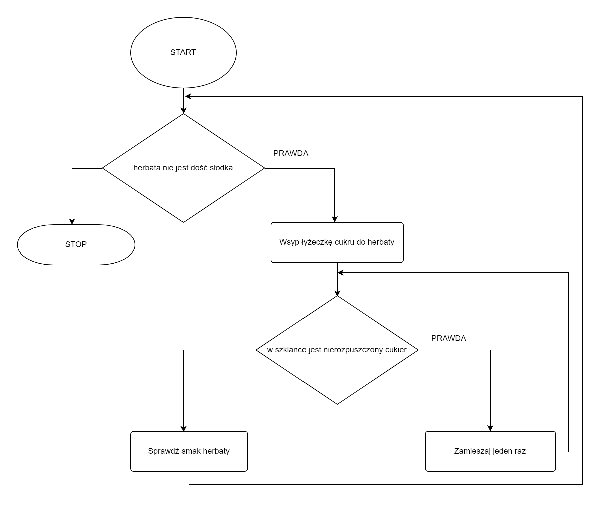

# Conditional loop

## Introduction

It very often happens that we have to repeat certain operations many times. For example, look at the lights from the introduction to the conditional statement. We have specified in the algorithm that when the light is red we have to stand and wait. Everything is nice and beautiful, but what when the light turns green? Should we then run the algorithm again? We can do that. However, there is also another solution. We know at traffic lights you should wait until the light turns green. So we could say: stay **as long as the light is red**. Or else: **as long as the light is red, stay**. This is just a conditional loop.

## Simple loop

Let's start with a simple loop - a single conditional loop inside which there are some operations to repeat. In order to better understand how the loop works, let's consider an example.

### Example - tea sweetening algorithm

Consider the following problem: there is bitter tea in front of us. Our task is to sweeten it with a teaspoon of sugar and then stir it to dissolve the sugar. Note, however, that we do not know in advance how long it will take to mix the tea. Maybe it is enough to stir a few times while the tea is hot, or maybe it will take longer to stir. Therefore, a conditional loop will help here.

Let's consider: what is the condition for blending tea? When do we have to stir the tea again? When we have undissolved sugar in the glass. So let's try to construct an algorithm for sweetening tea.

#### List of steps

``
1. Put a teaspoon of sugar in your tea
2. While there is undissolved sugar in the glass, do the following:
    3. Stir once
4. Check the taste of the tea
``

Note the indentation in the algorithm example above. So often we specify that the statement is inside a loop, just like we did with a conditional statement.

#### Block diagram

Look carefully at the above block diagram. Note that we don't have a separate block for the conditional loop. To do the loop, we use a conditional statement, and then we put the appropriate arrow just in front of the statement, thereby _ ** looping ** _ our diagram.

## Nested loop

We already know what a simple conditional loop looks like. Sometimes, however, one loop is not enough. Sometimes we have to nest two (or more) loops inside each other, thereby achieving multiple repetitions. Let's see how it looks like on an example.

### Example - repeated sweetening of tea

We will consider the problem of sweetening tea again. Note that in the previous example, we sweetened the tea with one teaspoon of sugar. What if someone likes tea sweetened with two, three, or even four teaspoons of sugar? We need a ** second loop ** to sweeten the tea repeatedly.

We already know how to dissolve sugar in tea. The question now is: how long to sweeten the tea? The answer seems simple: as long as the tea is not sweet enough for us, we will sweeten it. So let's try to construct an algorithm.

#### List of steps

``
1. While the tea is not sweet enough, do the following:
    2. Put a teaspoon of sugar in the tea
    3. While there is undissolved sugar in the glass, do the following:
        4. Stir once
    5. Check the taste of the tea
``

Note the double indentation in the above notation. Statement 4 Located inside two loops.

#### Block diagram

