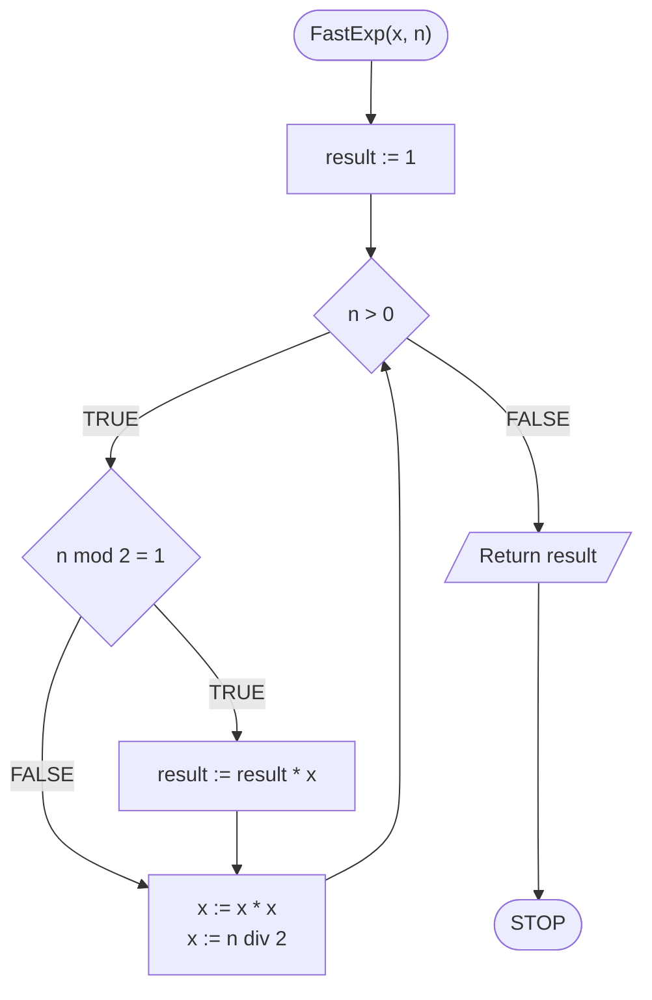
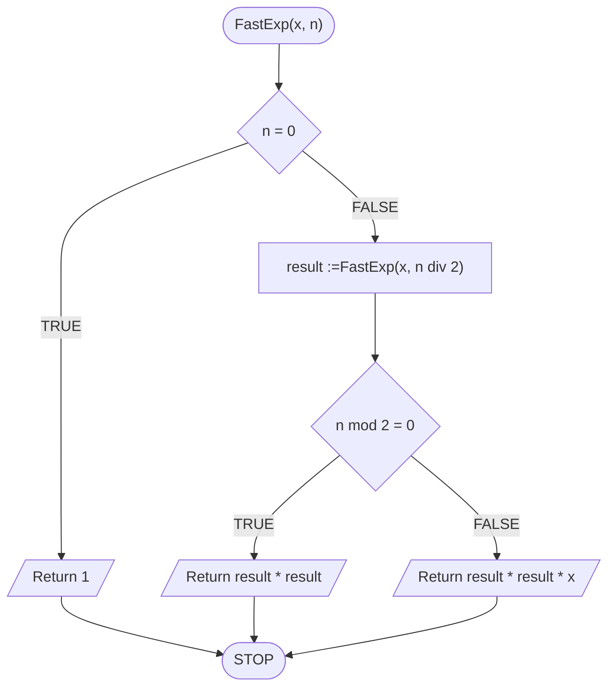

# Fast exponentiation

## Problem description

Zadanie jest proste: mamy podnieść liczbę do zadanej potęgi. Jak to jednak zwykle bywa, można to zrobić na różne sposoby, spośród których jedne będą szybsze, a inne wolniejsze. Zacznijmy od przykładu.

$$
x^4=x*x*x*x
$$

Jak widać w powyższym przykładzie, aby podnieść $$x$$ do potęgi 4, musimy wykonać **3 mnożenia**.

Zauważmy jednak, że pewne obliczenia będziemy wykonywać wielokrotnie:

$$
x^4=x^2*x^2
$$

Możemy najpierw obliczyć $$x^2$$ a następnie wynik podnieść do kwadratu:

$$
x^4=(x^2)^2
$$

Jak przeanalizujemy powyższy przykład to zobaczymy, że teraz wystarczy wykonać **2 mnożenia**!

Zobaczmy, że podobnie postępować możemy także z innymi potęgami, np.:

$$
x^8=(x^4)^2=((x^2)^2)^2
$$

Zamiast oryginalnych **7 mnożeń**, wystarczy wykonać **3 mnożenia**.

### Wykładnik nieparzysty

Co jednak w sytuacji, gdy wykładnik potęgi nie jest parzysty? Spójrzmy na poniższy przykład:

$$
x^5=(x^2)^2*x
$$

### Specification

#### Input:

* $$x$$ — liczba całkowita, podstawa potęgi
* $$n$$ — liczba naturalna, wykładnik potęgi

#### Output:

* $$x^n$$

## Iterative solution

### Pseudocode

```
function FastExp(x, n):
    1. result := 1
    2. While n > 0, do:
        3. If n mod 2 = 1, then:
            4. result := result * x
        
        5. x := x * x
        6. n := n div 2
    
    7. Return result
```

### Block diagram



### Complexity

$$O(\log{n})$$ — logarytmiczna

## Recursive solution

### Definicja rekurencyjna

$$
potega(x,n)=\left\{ \begin{array}{c1}
1 & : \ n = 0 \\
potega(x, n\ div\ 2)^2 & : \ n\ mod\ 2 = 0 \\
potega(x, n\ div\ 2)^2 * x & : \ n\ mod\ 2 = 1
\end{array} \right.
$$

### Pseudocode

```
function FastExp(x, n):
    1. If n = 0, then:
        2. Return 1
    
    3. result := FastExp(x, n div 2)

    4. If n mod 2 = 0, then:
        5. Return result * result
    
    6. else:
        7. Return result * result * x
```

### Block diagram



### Complexity

$$O(\log{n})$$ — logarytmiczna

## Implementation

### C++


[fast-exp.md](../../programming/c++/algorithms/numerical-methods/fast-exp.md)


### Python


[fast-exp.md](../../programming/python/algorithms/numerical-methods/fast-exp.md)

