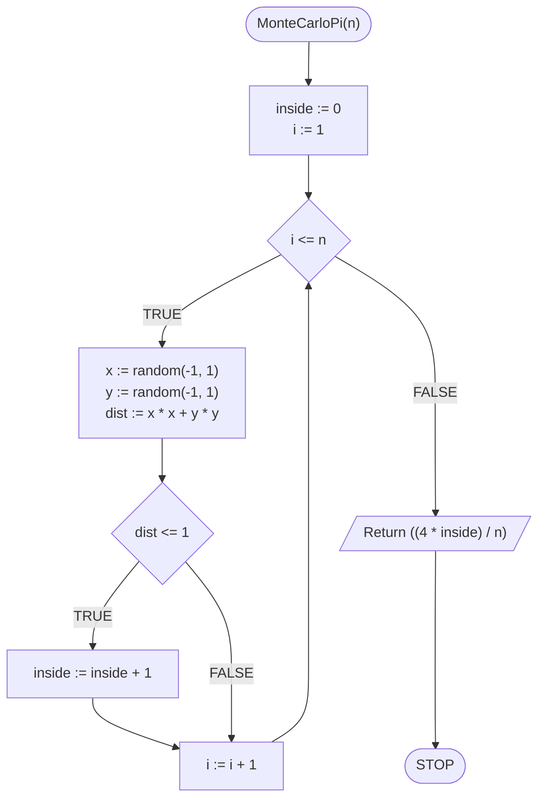

# Monte Carlo method

## Problem description

## Obliczanie przybliżonej wartości liczby PI

### Specification

#### Input

* $$n$$ — liczba prób (im większa, tym większa dokładność)

#### Output

* $$pi$$ — przybliżona wartość liczby $$\pi$$

### Solution

### Pseudocode

```
function MonteCarloPI(n)
    1. inside := 0
    2. From i := 1 to n, do:
        3. x := random real number from -1 to 1
        4. y := random real number from -1 to 1
        5. dist := (x * x) + (y * y)
        6. If dist <= 1, then:
            7. inside := inside + 1
    
    8. Return ((4 * inside) / n)
```

### Block diagram



## Implementation

### C++


[monte-carlo.md](../../programming/c++/algorithms/numerical-methods/monte-carlo.md)


### Python


[monte-carlo.md](../../programming/python/algorithms/numerical-methods/monte-carlo.md)

