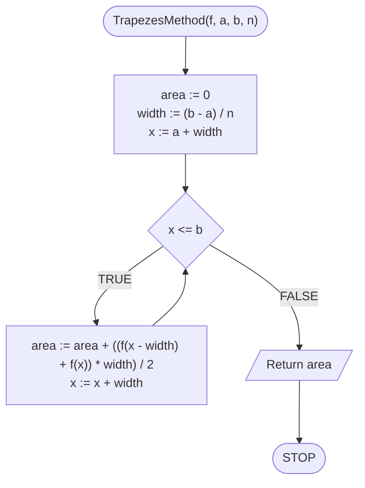

# Numerical integration

## Problem description

The slogan "numerical integration" may sound terrible, but the concept itself is quite easy to understand. It is nothing more but counting the area under the function chart in a given range. Of course, in general, this value is quite complicated to calculate, so here we will focus on approximating this value.

There are two basic methods: rectangles method and trapezes method.

### Specification

#### Input

* $$f(x)$$ — function
* $$a$$ — real number, beginning of the range
* $$b$$ — real number, end of the range
* $$n$$ — number of divisions

#### Output

* Approximated value of the area under the function graph $$f(x)$$ in the range $$[a,b]$$

## Solution — rectangles method

The idea of this method is simple: let's divide the area under the function chart into rectangles and count their areas.

### Pseudocode

```
function RectanglesMethod(f, a, b, n):
    1. area := 0
    2. width := (b - a) / n
    3. x := a + width
    
    4. While x <= b, do:
        5. height := f(x)
        6. area := area + width * height
        7. x := x + width
        
    8. Return area
```

### Block diagram


## Solution — trapezes method

For better accuracy, we can divide the area under the function chart into trapezes.

### Pseudocode

```
function TrapezesMethod(f, a, b, n):
    1. area := 0
    2. width := (b - a) / n
    3. x := a + width
    
    4. While x <= b, do:
        5. area := area + ((f(x - width) + f(x)) * width) / 2
        6. x := x + width

    7. Return area
```

### Block diagram



## Implementation

### C++


[numerical-integration.md](../../programming/c++/algorithms/numerical-methods/numerical-integration.md)


### Python


[numerical-integration.md](../../programming/python/algorithms/numerical-methods/numerical-integration.md)


### Kotlin


[numerical-integration.md](../../programming/kotlin/algorithms/numerical-methods/numerical-integration.md)
