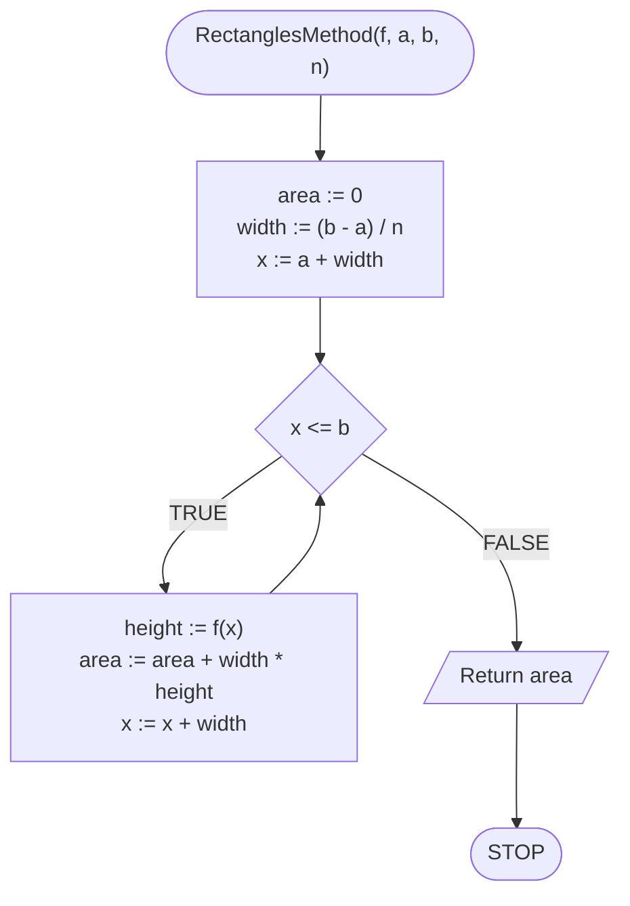

# Całkowanie numeryczne

## Opis problemu

Hasło "całkowanie numeryczne" może brzmieć strasznie, ale samo pojęcie jest dość proste do zrozumienia. To nic innego, niż policzenie pola pod wykresem funkcji w zadanym przedziale. Oczywiście w ogólności to zadanie jest dość skomplikowane obliczeniowo, dlatego tutaj skupimy się na przybliżeniu tej wartości.

Wyróżniamy dwie podstawowe metody: metodę prostokątów i metodę trapezów.

### Specyfikacja

#### Dane

* $$f(x)$$ — funkcja, której wykres nas interesuje
* $$a$$ — liczba rzeczywista, początek przedziału
* $$b$$ — liczba rzeczywista, koniec przedziału
* $$n$$ — liczba podziałów (im większa, tym większa dokładność)

#### Wynik

* $$pole$$ — przybliżona wartość pola pod wykresem funkcji $$f(x)$$ w przedziale $$[a,b]$$

## Rozwiązanie — metoda prostokątów

Idea tej metody jest prosta: podzielmy pole pod wykresem funkcji na prostokąty i policzmy ich pole.

### Pseudokod

```
function RectanglesMethod(f, a, b, n):
    1. area := 0
    2. width := (b - a) / n
    3. x := a + width
    
    4. While x <= b, do:
        5. height := f(x)
        6. area := area + width * height
        7. x := x + width
        
    8. Return area
```

### Block diagram



## Rozwiązanie — metoda trapezów

W celu uzyskania lepszej dokładności, możemy podzielić pole pod wykresem funkcji na trapezy.

### Pseudokod

```
function TrapezesMethod(f, a, b, n):
    1. area := 0
    2. width := (b - a) / n
    3. x := a + width
    
    4. While x <= b, do:
        5. area := area + (f(x - width) + f(x) * width) / 2
        6. x := x + width

    7. Return area
```

### Block diagram


## Implementacja

### C++


[numerical-integration.md](../../programming/c++/algorithms/numerical-methods/numerical-integration.md)


### Python


[numerical-integration.md](../../programming/python/algorithms/numerical-methods/numerical-integration.md)


### Kotlin


[numerical-integration.md](../../programming/kotlin/algorithms/numerical-methods/numerical-integration.md)
