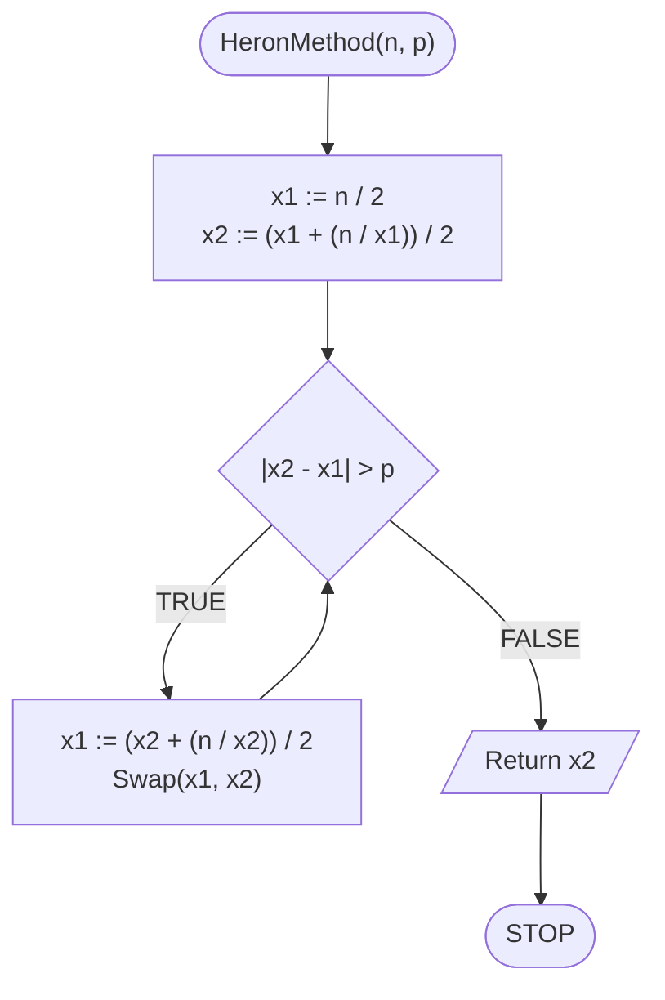

# Pierwiastek kwadratowy

## Opis problemu

Jak policzyć pierwiastek kwadratowy z podanej liczby, gdy nie mamy przy sobie kalkulatora, ani wbudowanych metod programistycznych?

### Specyfikacja

#### Dane

* $$n$$ — liczba rzeczywista.
* $$p$$ — liczba rzeczywista, dokładność.

#### Wynik

* $$\sqrt{n}$$ policzony z dokładnością $$p$$

## Rozwiązanie — metoda Herona

### Pseudokod

```
function HeronMethod(n, p):
    1. x1 := n / 2
    2. x2 := (x1 + (n / x1)) / 2
    3. While |x2 - x1| > p, do:
        4. x1 := (x2 + (n / x2)) / 2
        5. Swap(x1, x2)
    6. Return x2
```

### Block diagram



## Implementacja

### C++


[square-root.md](../../programming/c++/algorithms/numerical-methods/square-root.md)


### Python


[square-root.md](../../programming/python/algorithms/numerical-methods/square-root.md)

