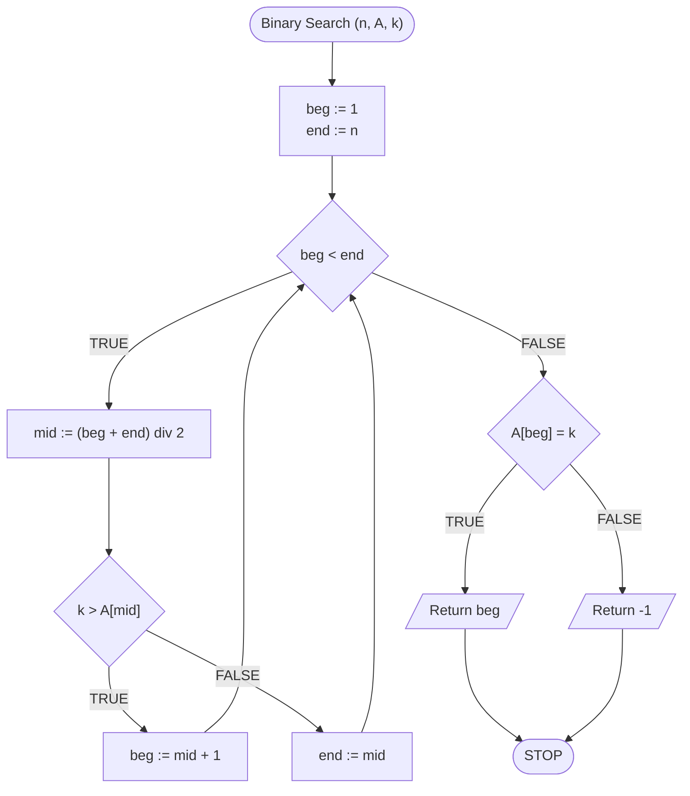

# Wyszukiwanie binarne

## Opis problemu

W wielu przypadkach, gdy musimy coś znaleźć, np. książkę na półce w bibliotece, to będziemy mieć do czynienia z konkretnym porządkiem.
Książki mogą być ułożone według tematyki, **posortowane** po nazwisku autora i tytule.
Znacząco ułatwia to znalezienie pożądanej pozycji, ponieważ **wiemy, gdzie szukać**.

Tak samo jest też w świecie algorytmiki. Gdy pracujemy na danych **posortowanych**, to zazwyczaj możemy skonstruować efektywne algorytmy do rozwiązania problemu. 

Jak zwykle, zacznijmy od formalnej specyfikacji, by lepiej zrozumieć problem, z którym będziemy się mierzyć.

### Specyfikacja

#### Dane:

* $$n$$ - liczba naturalna, ilość elementów w tablicy
* $$A[1..n]$$ - $$n-elementowa$$ tablica liczb całkowitych, posortowana niemalejąco, indeksowana od jedynki
* $$k$$ - liczba całkowita, szukana wartość

#### Wynik:

* Indeks wartości $$k$$ w tablicy $$A$$, lub $$-1$$ jeżeli tej wartości nie ma w tablicy

### Przykład

#### Dane

```
n := 5
A := [1, 2, 5, 7, 9]
k := 7 
```

**Wynik**: $$4$$ 

## Rozwiązanie iteracyjne

Zacznijmy od wersji iteracyjnej. Na początku definiujemy początek i koniec przeszukiwanego przedziału. Jako początek przyjmujemy numer pierwszego elementu (czyli $$1$$), a jako koniec numer ostatniego elementu (czyli $$n$$). W pętli będziemy powtarzać przeszukiwanie tak długo, jak długo nasz zdefiniowany przez początek i koniec przedział będzie zawierał co najmniej jeden element. Inaczej mówiąc, powtarzamy tak długo, jak długo początek jest mniejszy od końca.

Wewnątrz pętli najpierw obliczamy środek przeszukiwanego przedziału. Następnie sprawdzamy, jak element znajdujący się na środku ma się do naszego poszukiwanego elementu. Jeżeli poszukiwane element jest większy od elementu, który mamy na środku, to znaczy, że należy szukać po prawej stronie od środka: przesuwamy więc początek naszego przedziału na prawo od środka. W przeciwnym przypadku, czyli gdy poszukiwany element jest mniejszy bądź równy elementowi na środku, oznacza to, że należy szukać po lewej stronie od środka (ale nie możemy wykluczyć też elementu na środku!). W związku z tym przesuwamy koniec przedziału na środek. 

Gdy już wyjdziemy z pętli pozostaje nam sprawdzić, czy znaleźliśmy poszukiwany element. Sprawdzamy, czy pod indeksem wskazującym na zmieniony początek (lub koniec) przedziału znajduje się poszukiwana wartość. Jeżeli tak, to zwracamy jako wynik ten indeks. W przeciwnym przypadku zwracamy $$-1$$.

### Pseudokod

```
funkcja SzukajBinarnie(n, A, k)
    1. pocz := 1
    2. kon := n
    3. Dopóki pocz < kon, wykonuj:
        4. srodek := (pocz + kon) div 2
        
        5. Jeżeli k > A[srodek], to:
            6. pocz := srodek + 1
        
        7. W przeciwnym przypadku:
            8. kon := srodek

    9. Jeżeli A[pocz] = k, to:
        10. Zwróć pocz, zakończ
    11. W przeciwnym przypadku:
        12. Zwróć -1, zakończ
```


**div** oznacza dzielenie całkowite


### Schemat blokowy



### Złożoność

$$O(\log n)$$ - logarytmiczna

## Rozwiązanie rekurencyjne

W rozwiązaniu rekurencyjnym zamiast rozmiaru tablicy podajemy początek i koniec przeszukiwanego przedziału. Zaczynamy od sprawdzenia warunku stopu rekurencji: poprawności przedziału. Następnie postępujemy podobnie jak w wersji iteracyjnej. Obliczamy środek przedziału i porównujemy element znajdujący się na środku z poszukiwaną wartością. W zależności od wyniku porównania wykonujemy wywołanie rekurencyjne odpowiednio modyfikując przeszukiwany przedział.

### Pseudokod

```
funkcja SzukajBinarnie(A, k, pocz, kon)
    1. Jeżeli pocz >= kon, to:
        2. Jeżeli A[pocz] == k, to:
            3. Zwróć pocz, zakończ
        4. W przeciwnym przypadku:
            5. Zwróć -1, zakończ
    
    6. srodek := (pocz + kon) div 2
    
    7. Jeżeli k > A[srodek], to:
        8. Zwróć SzukajBinarnie(A, k, srodek+1, kon)
    
    9. W przeciwnym przypadku:
        10. Zwróć SzukajBinarnie(A, k, pocz, srodek)
```

### Block diagram


### Złożoność 

$$O(\log n)$$ - logarytmiczna

## Implementacja

### C++


[binary-search.md](../../programming/c++/algorithms/searching/binary-search.md)


### Python


[binary-search.md](../../programming/python/algorithms/searching/binary-search.md)


### Blockly


[binary-search.md](../../programming/blockly/algorithms/searching/binary-search.md)


### Kotlin


[binary-search.md](../../programming/kotlin/algorithms/searching/binary-search.md)
