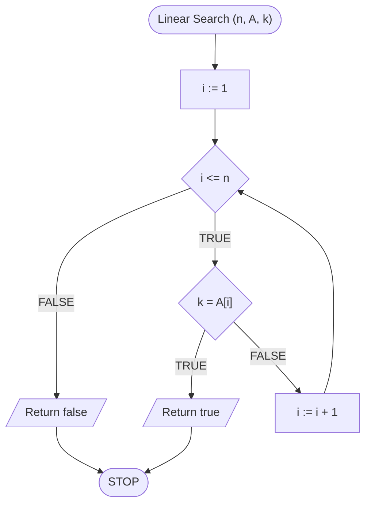
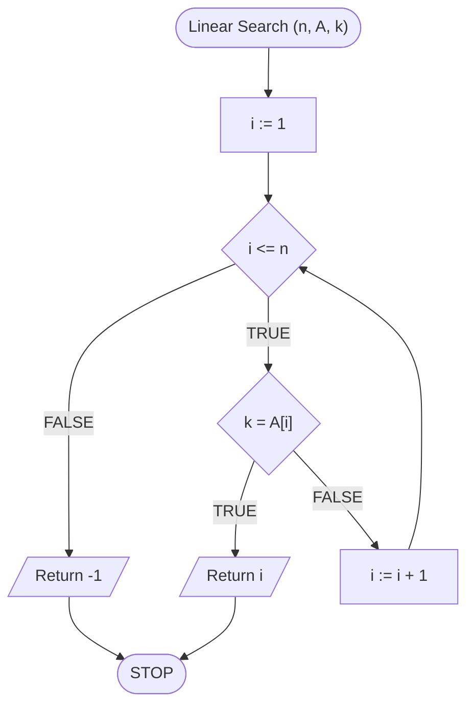
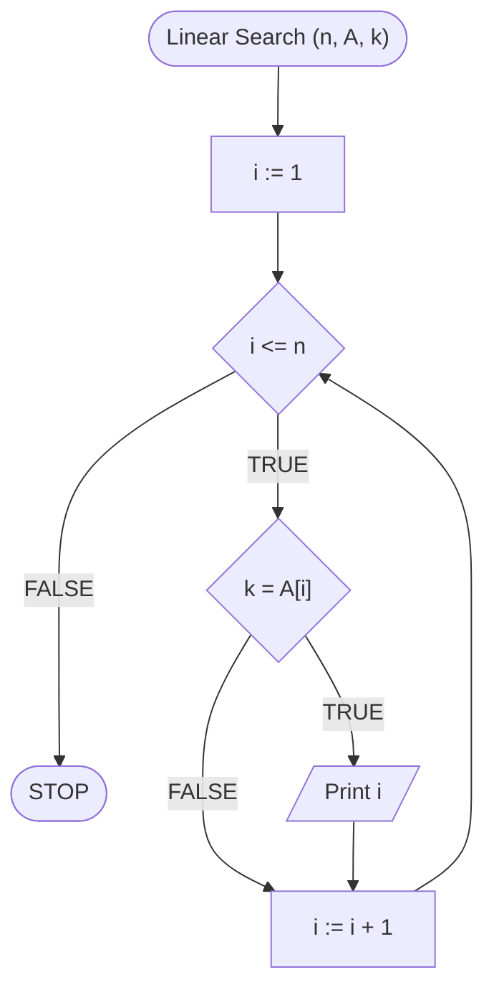

# Linear search

## Problem description

Imagine a shelf with books. 
Books on the shelf are arranged in random order, **without keeping any sensible order**. 
In other words: they are unordered. 
Our task is to find one specific book. 
We know its title, we know the author. 
How do we find it?

If we do not want to spend more time on this task than necessary and organize books before starting to search, the solution is simple.
We need to check every book.
We can do it in a random way and count on our luck or we can search them in an orderly manner.
So we check the books one after the other, from left to right (or from right to left) until we come across the book we are searching for.
And this type of approach is called **linear search**.

Of course, we will not search for books on the computer (although sometimes we do), only we will deal with searching the array of elements in search of a specific, given value.

There are, of course, several versions of this problem.
Let's start with the first one, perhaps the simplest.

## Existence of an element

### Problem description

One of the simplest version of the search problem is to check if the element exists in the set.
Imagine that we are in the store and ask the salesman is there a milk.
The person reviews the available products and responds: **Yes** or **No**.
In this case, we are only interested in whether the milk is currently on sale, not how many liters of milk are available, or where this product is placed.

Our goal will be to check if the element is present in the array.
Let's start with the formal specification and a few examples.

### Specification

#### Input:

* $$n$$ - natural number, number of elements in the array
* $$A[1..n]$$ - array of $$n$$ integers
* $$k$$ - integer, wanted value

#### Output:

* Value $$true$$, if number $$k$$ is present in the array $$A$$, or $$false$$ otherwise

### Example 1

#### Input:

```
n := 5
A := [5, 2, 7, 9, 1]
k := 7 
```

**Output**: $$true$$ 


**Explanation**

Wanted value in the array is $$7$$. 
As you can see, this value is present in the array, hence the result is $$true$$.


### Example 2

#### Input:

```
n := 5
A := [5, 2, 7, 9, 1]
k := 3
```

**Output**: $$false$$


**Explanation**

We are looking for $$3$$, which does not appear in the array.
Therefore, the result is $$false$$.


### Solution

We already know the problem, now the question is how to solve it?
What algorithm we will construct?
We are after the **linear search** algorithm, i.e. checking elements **one after the other**.
And we will do exactly that.
We will browse the elements **from the first to the last**.
Each subsequent element from the array will be **compared to the value $$k$$**.

Now the question is: **What do we do when we come across a wanted element**?
The answer is relatively simple.
When we find that the wanted element is in the array (i.e. when we find it), then we should return **Suitable result**, or $$true$$.
And what do we do next? 
Well, at this point we can already end the calculation **because we have found the existence of an element in the array**.
So we can finish, good job!

However, we still have to consider the situation in which the element sought **is not present in the array**.
What do we do in this case?
Of course, we should return the value $$false$$, but how to say that the element does not exist in the array?
Let's think about this for a moment.
When we find an element in the array, we return the value $$true$$ and finish the operation.
When we do not find the element in the array, then **we will not** return the value $$true$$ and we will just check **all elements of the array**.

In that case, when we check all the elements of the array and **we will continue to perform further operations** (because we have not finished the operation earlier) it will mean that we did not find the element in the array!
In that case, we return $$false$$ and finish the operation.


Please note that the value of $$false$$ should be returned **after** checking **all** array elements, i.e. **after leaving the loop**.


### Pseudocode

```
function LinearSearch(n, A, k)
    1. From i := 1 to n, do:
        2. If k = A[i], then:
            3. Return true and finish
        
    4. Return false and finish
```

### Block diagram



### Complexity 

The main element of the algorithm is a loop passing through all the values in the array.
This loop performs exactly $$n$$ repetitions.
Therefore, we get linear complexity.

$$O(n)$$ - linear

## Element position

### Problem description

Sometimes it is not enough for us that the element is _somewhere_ in tha array.
Sometimes we need to know exactly where it is.
In other words, we want to know the location or index in the array under which the value is placed (if, of course, it is in the array).
Let's start with the formal specification and a few examples.


The value can occur repeatedly in the array.
However, we are interested in its **any** location.


### Specification

#### Input:

* $$n$$ - natural number, number of elements in the array
* $$A[1..n]$$ - array of $$n$$ integers
* $$k$$ - integer, wanted value

#### Output:

* An index of any instance of value $$k$$ in the $$A$$ array, or $$-1$$ if this value is not in the array

### Example 1

#### Input:

```
n := 5
A := [5, 2, 7, 9, 1]
k := 7 
```

**Output**: $$3$$ 


**Explanation**

The wanted value in the array is $$7$$.
As you can see, this value is on the third place in the array, hence the result is $$3$$.


### Example 2

#### Input:

```
n := 5
A := [5, 2, 7, 9, 1]
k := 3
```

**Output**: $$-1$$


**Explanation**

We are looking for $$3$$, which does not appear in the array.
Therefore, the result is $$-1$$.


### Solution

To construct the solution of this problem, we will use the previous solution.
Let us think about the differences between these two problems and what we need to change.

The difference is really only in the values we have to return as a result.
Previously, we returned $$true$$ when the element existed in the array.
Now we are to return its **index**.
This means that we need to change the instructions in which we return $$true$$ (number 3).
We should return the element index at this point, but where to get this value?
Let's look at the preceding condition.
In it, we check whether the search value is present under **currently checked index** in the table.
And what is the index?
This index is determined by a variable that is a **iterator of our loop**, i.e. through a $$i$$ variable.
In that case, instead of $$true$$, we return the value of the $$i$$ variable.
Ready!

Now let's focus on the second possible result.
Before we have returned $$false$$.
What should we now return when the element does not appear in the array?
Just look at the specification.
We replace $$false$$ with the value of $$-1$$.

### Pseudocode

```
function LinearSearch(n, A, k)
    1. From i := 1 to n, do:
        2. If k = A[i], then:
            3. Return i, finish
        
    4. Return -1, finish
```

### Block diagram



### Complexity 

$$O(n)$$ - linear

## All positions of the element

### Problem description

We know how to check if the value occurs in the array, as well as how to check its position in this array.
What, however, when we want to know **all** occurrences of the sought-in element in the array?
Now we will deal with this problem.

### Specification

#### Input:

* $$n$$ - natural number, number of elements in the array
* $$A[1..n]$$ - array of $$n$$ integers
* $$k$$ - integer, wanted value

#### Output:

* List of all indices under which value $$k$$ occurs in the $$A$$ array

### Example 1

#### Input:

```
n := 5
A := [7, 2, 7, 9, 7]
k := 7 
```

**Output**: $$[1, 3, 5]$$ 


**Explanation**

The wanted value in the table is $$7$$.
As you can see, this value is on the first, third and last (fifth) place in the table.


### Example 2

#### Input:

```
n := 5
A := [7, 2, 7, 9, 7]
k := 3 
```

**Output**: $$[\ ]$$ 


**Explanation**

The wanted value in the table is $$3$$.
As you can see, this value does not occur in the array, hence the result is empty because the list of indexes is empty.


### Solution

In general, returning the list or array as the result of the function can be problematic, depending on the programming language.
That's why we will focus on something similar, i.e. we will write all the results on the screen.

Consider how to modify the previous solution.
What are the differences between this version of the problem, and the previous one, in which as the result we returned the index of only one, first instance of the value in the array.

First of all, now we want to print **all** indexes under which the value is searched.
In that case, we can not end actions after finding the first occurrence, we must go on.
More specifically, we have to review **a whole array**.
In that case, we make two changes in the previous solution: instead of _return_ we will do _print_ and remove the _finish__ command. 

We need one more modification.
Note that now we do not have to think about what to do if the element does not appear in the array.
In this case, we will just not write anything to the screen.
Therefore, we remove the last instructions (number 4) in which we return the result -1.

### Pseudocode

```
procedura LinearSearch(n, A, k):
    1. From i := 1 to n, do:
        2. If k = A[i], then:
            3. Print i
```

### Block diagram



### Complexity

$$O(n)$$ - linear

## Impementation — main

### Pascal


[linear-search.md](../../programming/pascal/algorithms/searching/linear-search.md)


### C++


[linear-search.md](../../programming/c++/algorithms/searching/linear-search.md)


### Python


[linear-search.md](../../programming/python/algorithms/searching/linear-search.md)


### Blockly


[linear-search.md](../../programming/blockly/algorithms/searching/linear-search.md)


## Implementation — other

### C


[linear-search.md](../../programming/c/algorithms/searching/linear-search.md)


### Dart


[linear-search.md](../../programming/dart/algorithms/searching/linear-search.md)


### Elixir


[linear-search.md](../../programming/elixir/algorithms/searching/linear-search.md)


### Go


[linear-search.md](../../programming/go/algorithms/searching/linear-search.md)


### Haskell


[linear-search.md](../../programming/haskell/algorithms/searching/linear-search.md)


### JavaScript


[linear-search.md](../../programming/javascript/algorithms/searching/linear-search.md)


### Julia


[linear-search.md](../../programming/julia/algorithms/searching/linear-search.md)


### Kotlin


[linear-search.md](../../programming/kotlin/algorithms/searching/linear-search.md)


### Lua


[linear-search.md](../../programming/lua/algorithms/searching/linear-search.md)


### Rust


[linear-search.md](../../programming/rust/algorithms/searching/linear-search.md)


### Scheme


[linear-search.md](../../programming/scheme/algorithms/searching/linear-search.md)


### Swift


[linear-search.md](../../programming/swift/algorithms/searching/linear-search.md)


### TypeScript


[linear-search.md](../../programming/typescript/algorithms/searching/linear-search.md)


### Visual Basic


[linear-search.md](../../programming/visual-basic/algorithms/searching/linear-search.md)
