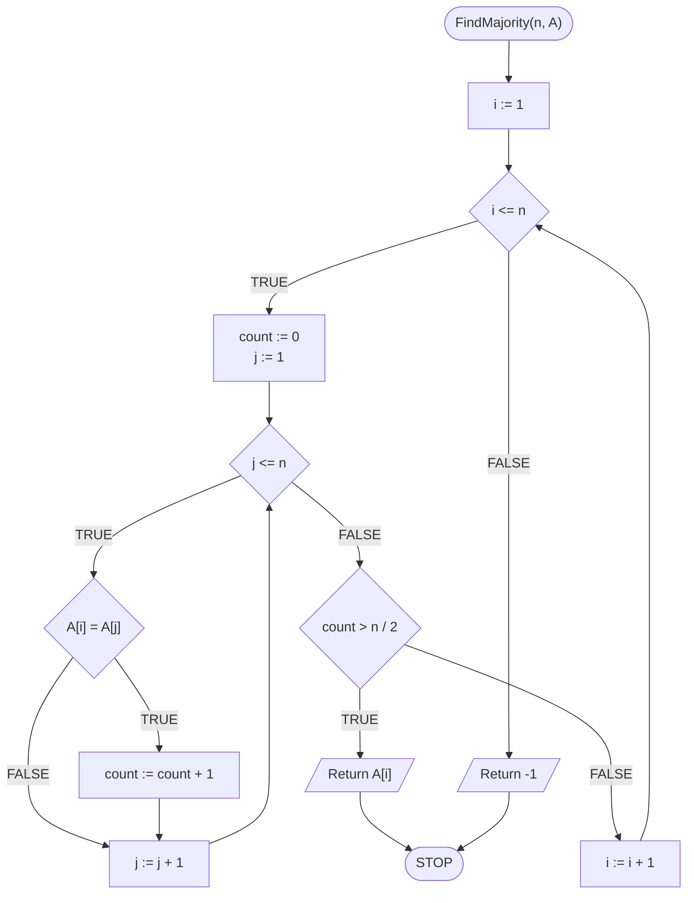
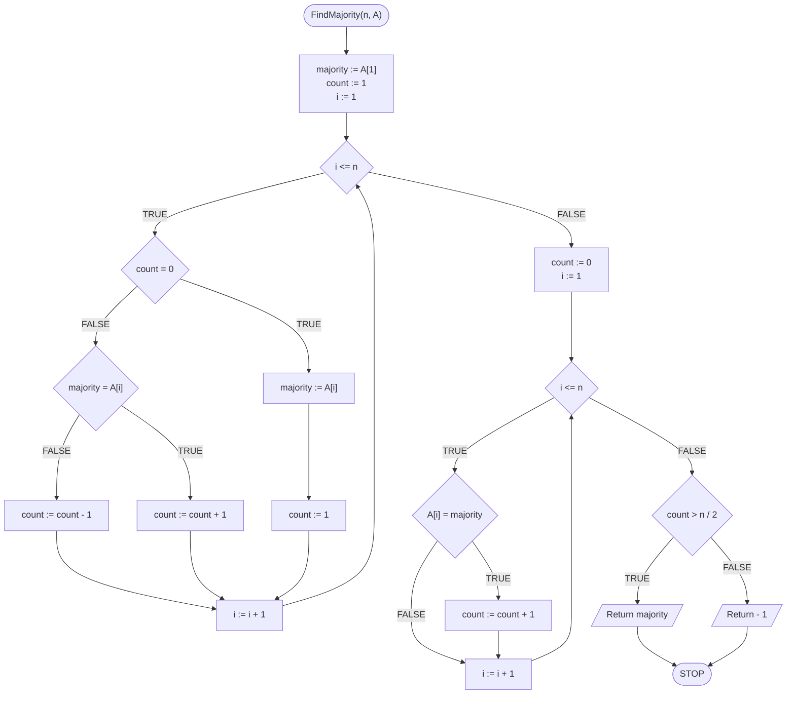

# Finding majority element

## Problem description

Majority is an element, which constitutes **most** of a given collection, and more precisely **more than half** of the collection. 

### Specification

#### Input

* $$n$$ — natural number
* $$A[1..n]$$ — array of integers

#### Output

* Majority element of A, or -1, if it doesn't exist.


#### Majority element

**The majority** of a collection is an element whose number of occurrences in the collection is greater than $$\frac{n}{2}$$.

If such an element does not exist, then the collection has no majority element.


### Example 1

#### Input

```
n := 10
A := [4, 1, 4, 4, 2, 3, 4, 3, 4, 4]
```

**Output**: 4


#### Explanation

The most common element in the above array is the value $$4$$, which occurs precisely $$6$$ times, which **is greater** than $$n/2=10/2=5$$.


### Example 2

#### Input

```
n := 10
A := [4, 1, 4, 4, 2, 3, 4, 3, 4, 1]
```

**Output**: $$-1$$ (no majority element)


#### Explanation

The most common element in the above array is the value $$4$$, which occurs precisely $$5$$ times, which **is no greater** than $$n/2=10/2=5$$.


## Naive solution

In order to conclude that a given element is a majority element, we need to know how many times it occurs in the collection. So if we count the number of occurrences in the collection for each element of the collection, we would be able to determine whether the collection has a majority element, and if so, what element is it. So we go through subsequent elements of the collection and count their occurrences. Of course, in this way we will count some elements many times, but that's why it is a naive solution.

### Pseudocode

```
function FindMajority(n, A):
    1. From i := 1 do n, do:
        2. count := 0
        3. From j := 1 to n, do:
            4. If A[i] = A[j], then:
                5. count := count + 1
        6. If count > n/2, then:
            7. Return A[i], stop
    8. Return -1
```

### Block diagram



### Complexity

$$O(n^2)$$

## Optimal solution

W rozwiązaniu optymalnym należy zacząć od pewnego spostrzeżenia. Jeżeli weźmiemy jakiś zbiór i usuniemy z niego dwa **różne** elementy, to powstały w ten sposób zbiór będzie miał takiego samego lidera. Dzięki tej obserwacji możemy "skreślać" parami różne elementy, aż nie zostanie nam nic do skreślenia. Oczywiście nie będziemy fizycznie wykreślać elementów z tablicy. To "skreślanie" zrealizujemy za pomocą odpowiedniego zliczania i zapamiętywania tzw. *kandydata na lidera*. Zaczniemy od przyjęcia pierwszego elementu z tablicy jako kandydata na lidera. Zliczymy także jego liczbę dotychczasowych "nieskreślonych" powtórzeń. Następnie przejdziemy przez kolejne wartości z tablicy. Jeżeli w którymś momencie nasz licznik się wyzeruje, to przyjmiemy obecny element jako nowego kandydata i licznik ustawimy na jeden. Jeżeli natomiast licznik będzie większy od zera, należy porównać kandydata z obecnym elementem z tablicy. Jeżeli napotkamy wartość równą kandydatowi, to zwiększamy licznik wystąpień kandydata. Jeżeli natomiast napotkamy wartość różną od kandydata, to będziemy symulować "skreślanie" poprzez zmniejszenie licznika wystąpień obecnego kandydata o jeden.

Gdy już przejdziemy przez wszystkie elementy tablicy to na koniec zostaniemy z jakimś kandydatem na lidera. Jeżeli zbiór ma lidera, to będzie nim ten kandydat. Może być jednak tak, że zbiór nie ma lidera. Dlatego pozostaje nam zliczyć liczbę wystąpień naszego kandydata w zbiorze, co realizujemy przechodząc element po elemencie. Na koniec sprawdzamy, czyli liczba wystąpień kandydata jest większa od połowy liczebności zbioru.

### Pseudocode

```
function FindMajority(n, A)
    1. majority := A[1]
    2. count := 1
    3. From i := 2 to n, do:
        4. If count = 0, then:
            5. majority := A[i]
            6. count := 1
        
        7. else if majority = A[i]:
            8. count := count + 1
        
        9. else:
            10. count := count - 1
        
    11. count := 0
    12. From i := 1 to n, do:
        13. If A[i] = majority, then:
            14. count := count + 1
        
    15. If count > n/2, then:
        16. Return majority, stop
    
    17. else:
        18. Return -1, stop
```

### Block diagram



### Complexity

$$O(n)$$ — linear

## Implementation

### C++


[majority.md](../../programming/c++/algorithms/searching/majority.md)


### Python


[majority.md](../../programming/python/algorithms/searching/majority.md)


### Kotlin


[majority.md](../../programming/kotlin/algorithms/searching/majority.md)
