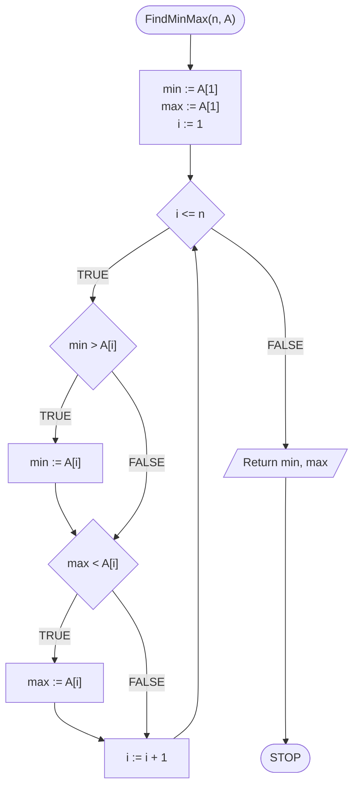
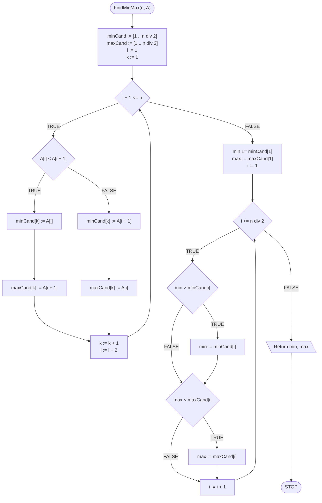

# Jednoczesne wyszukiwanie minimum i maksimum

## Problem description

Zdarza się i tak, że potrzebujemy znaleźć wartość minimalną i maksymalną jednocześnie, najlepiej za jednym razem. Możemy oczywiście osobno wyszukać minimum i maksimum korzystając ze standardowego algorytmu. Być może jednak da się to zrobić lepiej, wydajniej? Na to pytanie postaramy się odpowiedzieć. Zacznijmy od formalnej specyfikacji.

### Specification

#### Input:

* $$n$$ — liczba naturalna, liczba elementów w tablicy
* $$A[1..n]$$ — tablica $$n$$ wartości całkowitych

#### Output:

* Największa oraz najmniejsza wartość z tablicy $$A$$

### Example

#### Input

```
n := 5
A := [6, 3, 1, 9, 2]
```

#### Output

```
minimum := 1
maksimum := 9
```

## Naive solution

Zacznijmy od rozwiązania naiwnego. Pomysł jest następujący: zastosujmy standardowy algorytm do znajdowania minimum i maksimum. Na początku jako tymczasowe minimum i maksimum przyjmiemy wartość pierwszego elementu z tablicy. Następnie przejdziemy pętlą przez kolejne elementy. Każdy element będziemy porównywać z dotychczasowymi wartościami minimum i maksimum, dokonując odpowiednich zamian w razie potrzeby.

### Pseudocode

```
function FindMinMax(n, A):
    1. min := A[1]
    2. max := A[1]
    3. From i := 2 to n, do:
        4. If min > A[i], then:
            5. min := A[i]
        6. If max < A[i], then:
            7. max := A[i]
    8. Return min, max
```

### Block diagram



### Complexity

$$O(2n)$$ 

Mamy jedną pętlę, ale dwa porównania wewnątrz niej. W takim razie dla każdego przebiegu pętli wykonujemy dwa porównania, łącznie wykonujemy ich więc w przybliżeniu $$2n$$, co w praktyce daje nam złożoność liniową.

## Optimal solution

Podejdźmy do problemu od innej strony. Zastanówmy się, jak możemy przygotować sobie dane, aby ułatwić sobie pracę? Mamy pewien zestaw liczb, wśród których chcemy znaleźć zarówno minimum jak i maksimum. W takim razie podzielmy wstępnie nasze liczby na kandydatów minimum oraz kandydatów maksimum. Zrobimy to przechodząc po kolei po parach sąsiednich liczb z tablicy i porównując je ze sobą. Mniejszą z wartości z pary wrzucimy do kandydatów na minimum, a większą umieścimy w kandydatach na maksimum. W ten sposób uzyskamy dwie tablice, z których każda będzie miała długość równą połowie długości pierwotnej tablicy. Teraz możemy przejść do wyszukiwania minimum i maksimum. Minimum będziemy szukać standardowym algorytmem w tablicy kandydatów na minimum. Podobnie zrobimy z maksimum, szukając go w kandydatach na maksimum.


**Uwaga**

Dla ułatwienia zakładamy, że długość tablicy (wartość $$n$$) jest liczbą **parzystą**. Jeżeli tak nie jest, możemy np. powielić ostatni element tablicy, albo rozważyć ten szczególny przypadek w algorytmie.


### Pseudocode

```
function FindMinMax(n, A):
    1. minCand := [1 .. n div 2]
    2. maxCand := [1 .. n div 2]
    3. i := 1
    4. k := 1
    5. While i + 1 <= n, do:
        6. If A[i] < A[i+1], then:
            7. minCand[k] := A[i]
            8. maxCand[k] := A[i+1]
        9. else:
            10. minCand[k] := A[i+1]
            11. maxCand[k] := A[i]
        12. k := k + 1
        13. i := i + 2
    14. min := minCand[1]
    15. max := maxCand[1]
    16. From i := 2 to (n div 2), do:
        17. If min > minCand[i], then:
            18. min := minCand[i]
        19. If max < maxCand[i], then:
            20. max := maxCand[i]
    21. Return min, max
```

### Block diagram



### Complexity

$$O(3\frac{n}{2})$$ 

Najpierw dokonujemy podziału na dwie tablice pomocnicze wykonując $$\frac{n}{2}$$ operacji. Następnie wyszukujemy minimum i maksimum w odpowiednich tablicach. Każda z nich ma długość $$\frac{n}{2}$$, więc łącznie na znalezienie minimum i maksimum potrzebujemy wykonać $$2\frac{n}{2}=n$$ porównań. Wszystko razem daje nam $$3\frac{n}{2}$$ porównań. W praktyce wciąż mamy złożoność liniową, wykonujemy jednak mniej operacji niż przy algorytmie naiwnym.

## Implementation

### C++


[min-max-search.md](../../programming/c++/algorithms/searching/min-max-search.md)


### Python


[min-max-search.md](../../programming/python/algorithms/searching/min-max-search.md)


### Kotlin


[min-max-search.md](../../programming/kotlin/algorithms/searching/min-max-search.md)
