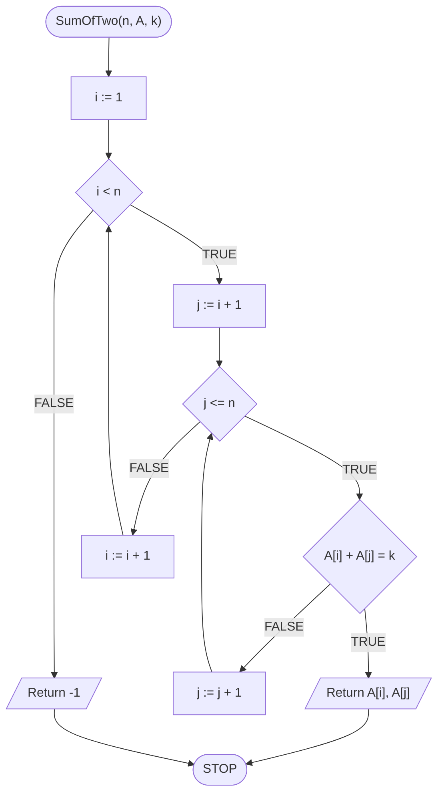
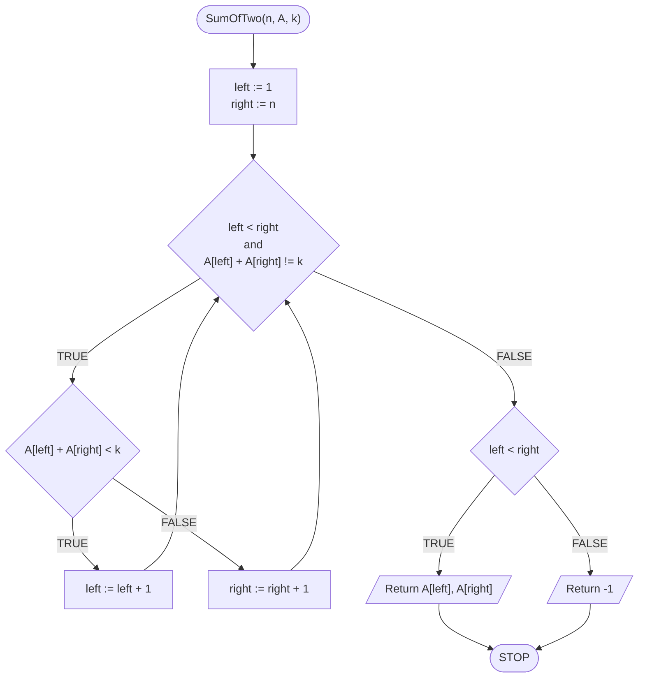

# Sum of two

## Problem description

Mamy pewien posortowany zbiór różnych liczb. W tym zbiorze mamy odnaleźć dwie liczby, które po dodaniu do siebie dadzą pożądaną sumę. Oczywiście, takie liczby wcale nie muszą w tym zbiorze się znajdować.

Problem może wydawać się dość abstrakcyjny i słabo związany z rzeczywistością. Niemniej jest to świetny problem do zaprezentowania, jak pomocne czasem jest pracowanie z danymi posortowanymi i jak duży wpływ może mieć na złożoność obliczeniową rozwiązania.

Zacznijmy od formalnej specyfikacji problemu.

### Specification

#### Input

* $$n$$ - natural number
* $$A[1..n]$$ - array of distinct integers, sorted in ascending order
* $$k$$ - natural number

#### Output

* $$a, b$$ - two distinct values from the array $$A$$ such that $$a+b=k$$
* $$-1$$ if such values can't be found

### Example

#### Input

```
n := 10
A[1..10] := [1, 2, 4, 6, 8, 9, 10, 12, 13, 15]
k := 18
```

**Output**: $$6,\ 12$$(or $$8,\ 10$$)

## Naive solution

Zacznijmy od pierwszego rozwiązania, jakie nam przychodzi do głowy.
Naszym celem jest znalezienie **pary** liczb, które dają pożądaną sumę.
W takim razie **sprawdźmy wszystkie pary** i zobaczmy, czy znajdziemy to czego szukamy.

Przechodzimy dwiema zagnieżdżonymi pętlami przez tablicę.
Zewnętrzna pętla będzie wskazywać nam indeks pierwszego elementu z pary, a wewnętrzna pętla będzie wskazywać drugiego elementu z pary.
W celu uniknięcia powtórzeń warto zadbać o odpowiednią konstrukcję wewnętrznej pętli.
Zasada jest bardzo prosta: wewnętrzna pętla zaczyna poszukiwania zawsze od **kolejnego** elementu względem zewnętrznej pętli.

Spróbujmy przelać nasze rozumowania na pseudokod.

### Pseudocode

```
function SumOfTwo(n, A, k):
    1. For i := 1 to n - 1, do:
        2. For j := i + 1 to n, do:
            3. If A[i] + A[j] = k, then:
                4. Return A[i], A[j]
    6. Return -1
```

### Block diagram



### Complexity

$$O(n^2)$$

## Optimal solution

W poprzednim rozwiązaniu całkowicie pominęliśmy fakt, że nasza tablica jest posortowana.
Zastanówmy się więc, jak możemy skorzystać z tego, że liczby są ułożone od najmniejszej do największej.

Spróbujmy do tego podejść w następujący sposób.
Weźmy pierwszy i ostatni element z tablicy.
Wiemy, że są to odpowiednio najmniejszy i największy element w tablicy.
Obliczmy ich sumę. Co możemy stwierdzić na jej podstawie?
Porównajmy ją z poszukiwaną wartością. Mamy trzy opcje:

- suma jest równa poszukiwanej wartości: klepiemy się po plecach i zwracamy wynik, praca zakończona
- suma jest mniejsza od poszukiwanej wartości: musimy szukać większej sumy, w tym celu bierzemy kolejny element z lewej strony tablicy (czyli większy)
- suma jest większa od poszukiwanej wartości: musimy szukać mniejszej sumy, w tym celu bierzemy kolejny element z prawej strony tablicy (czyli mniejszy).

I tak postępujemy w pętli, aż znajdziemy (albo i nie) poszukiwaną sumę.

Spróbujmy to zapisać w pseudokodzie.

### Pseudocode

```
function SumOfTwo(n, A, k):
    1. left := 1
    2. right := n
    3. While left < right and A[left] + A[right] != k, do:
        4. If A[left] + A[right] < k, then:
            5. left := left + 1
        6. else:
            7. right := right + 1
    8. If left < right, then:
        9. Return A[left], A[right]
    10. else:
        11. Return -1
```

### Block diagram



### Complexity

$$O(n)$$ - linear

## Implementation

### C++


[sum-of-two.md](../../programming/c++/algorithms/searching/sum-of-two.md)


### Python


[sum-of-two.md](../../programming/python/algorithms/searching/sum-of-two.md)


### Kotlin


[sum-of-two.md](../../programming/kotlin/algorithms/searching/sum-of-two.md)
