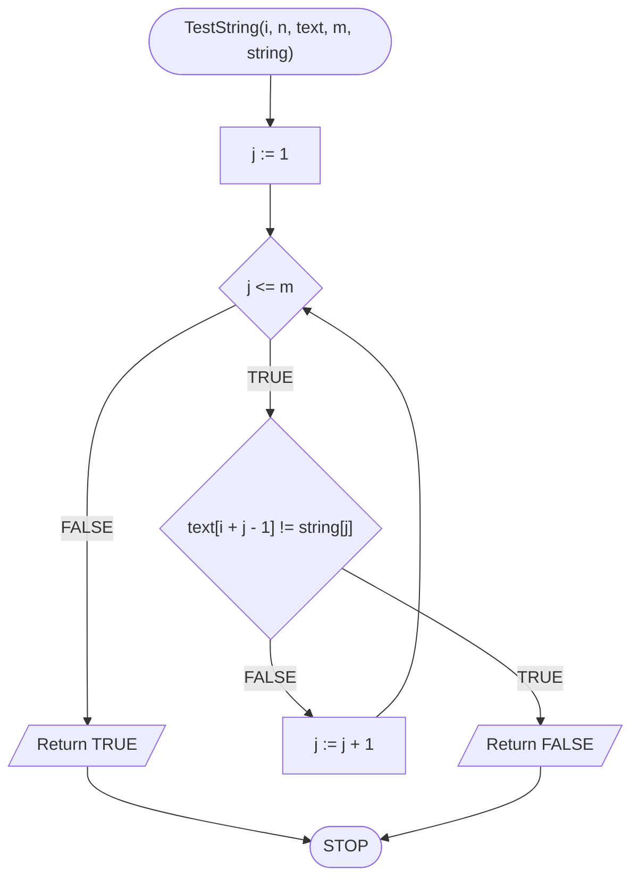
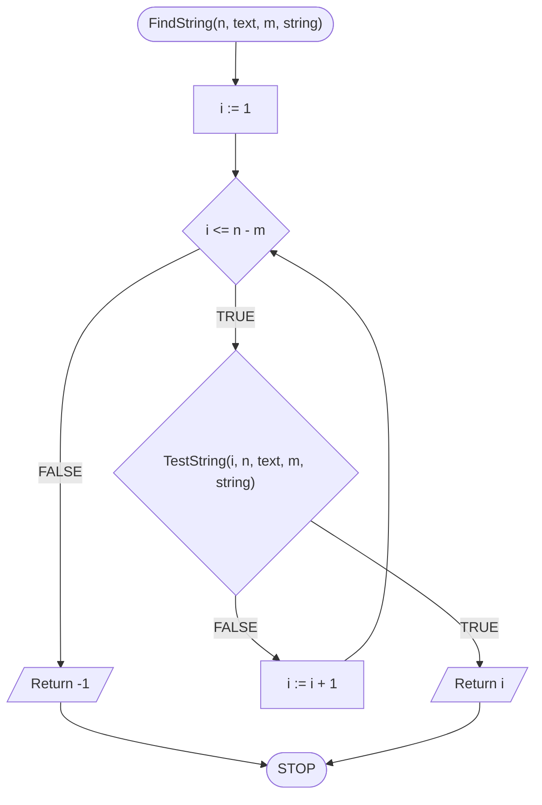

# Naiwne wyszukiwanie wzorca w tekście

## Problem description

Problem znalezienia jednego tekstu w drugim to problem, z którym mamy do czynienia praktycznie na co dzień, być może nawet nie zdając sobie z tego sprawy. Gdy jesteśmy na jakiejś stronie internetowej, albo mamy otwarty dokument tekstowy i wciskamy znany skrót CTRL+F, to wtedy właśnie wykonujemy przeszukiwanie tekstu w celu znalezienia wystąpień jakiegoś zadanego ciągu znaków.

Jak niemalże każdy problem (informatyczny), także ten możne zostać rozwiązany w sposób naiwny i takim właśnie rozwiązaniem początkowo się zajmiemy.

Problem wygląda następująco: dostajemy dwa teksty, nazwijmy je _tekst_ oraz _wzorzec_, a naszym (algorytmu) zadaniem jest sprawdzenie, czy _wzorzec_ zawiera się w _tekście_.&#x20;

### Specification

#### Input:

* $$n$$ - długość tekstu, $$n\in\mathbb{N}, n\geq1$$&#x20;
* $$tekst[1..n]$$ - ciąg znaków o długości $$n$$, numerowanych od jedynki&#x20;
* $$m$$ - długość wzorca,  $$m\in\mathbb{N}, 1\leq m\leq n$$
* $$wzorzec[1..m]$$ - ciąg znaków o długości $$m$$, numerowanych od jedynki&#x20;

#### Output:

* Indeks pierwszego wystąpienia wzorca w tekście, lub $$-1$$ jeżeli wzorzec nie występuje w tekście

### Example 1

#### Input

```
tekst := "alamakota"
wzorzec := "kot"
```

**Wynik**: $$6$$.

### Example 2

#### Input

```
tekst := "alamakota"
wzorzec := "koty"
```

**Wynik**: $$-1$$.

## Solution

Helper function `TestString` checks, if string is in the text under the index $$i$$.

### Pseudocode

```
function TestString(i, n, text, m, string)
    1. From j := 1 to m, do:
        2. If tekst[i+j-1] != string[j], then:
            3. Return FALSE
        
    4. Return TRUE
```

```
function FindString(n, text, m, string)
    1. From i := 1 to n-m, do:
        2. If TestString(i, n, text, m, string), then:
            3. Return i
        
    4. Return -1
```

### Block diagram





### Complexity

$$O(n*m)\to O(n^2)$$ - kwadratowa

## Implementation

### C++


[naive-substring-search.md](../../programming/c++/algorithms/text/naive-substring-search.md)


### Python


[naive-substring-search.md](../../programming/python/algorithms/text/naive-substring-search.md)

