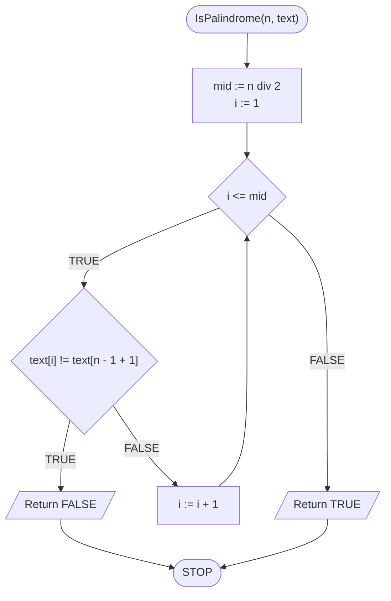

# Palindrom

## Problem description

**Palindrom** to wyraz, który czytany od lewej do prawej i od prawej do lewej jest taki sam.

### Specification

#### Input

* $$n$$ — długość tekstu
* $$tekst[1..n]$$ — ciąg znaków o długości $$n$$, numerowanych od jedynki

#### Output

* $$True$$ — jeżeli $$tekst$$ jest palindromem
* $$False$$ — w przeciwnym przypadku

### Example 1

#### Input

```
n := 5
tekst := "kajak"
```

#### Output: $$True$$


**Wyjaśnienie**

Wyraz **kajak** czytany od tyłu to **kajak**, jest on więc palindromem.


### Example 2

#### Input

```
n := 4
tekst := "tama"
```

**Wynik**: $$False$$


**Wyjaśnienie**

Wyraz **tama** czytany od tyłu to **amat**, nie jest on więc palindromem.


## Solution

Jednym ze sposobów na sprawdzenie, czy wyraz jest palindromem, jest przejście znak po znaku od lewej aż do środka i porównywanie ze znakami od prawej strony. Można to zrealizować za pomocą jednej pętli i odpowiedniego obliczania indeksu znaku "od końca". Dla przykładu, jeżeli mamy wyraz o długości $$6$$ znaków, to będziemy ze sobą porównywali parami znaki na pozycjach: $$(1, 6), (2, 5), (3, 4)$$. W momencie gdy tylko stwierdzimy, że znaki na odpowiadających sobie pozycjach się różnią, możemy zwrócić jako wynik *fałsz*, ponieważ oznacza to, że wyraz nie jest palindromem. Jeżeli natomiast przejdziemy tak przez wszystkie pary znaków i nie stwierdzimy sprzeczności, to po wyjściu z pętli wiemy, że wyraz jest palindromem, zwracamy więc wartość *prawda*.

### Pseudocode

```
function IsPalindrome(n, text):
    1. mid := n div 2
    2. From i := 1 to mid, do:
        3. If text[i] != text[n - i + 1], then:
            4. Return FALSE
    5. Return TRUE
```

### Block diagram



### Complexity

$$O(n/2)\to O(n)$$ — liniowa

Przechodzimy pętlą od $$1$$ do połowy długości wyrazu (czyli do $$\lfloor\frac{n}{2}\rfloor$$) porównując ze sobą odpowiednie pary znaków, stąd złożoność liniowa.

## Implementation

### C++


[palindrome.md](../../programming/c++/algorithms/text/palindrome.md)


### Python


[palindrome.md](../../programming/python/algorithms/text/palindrome.md)


