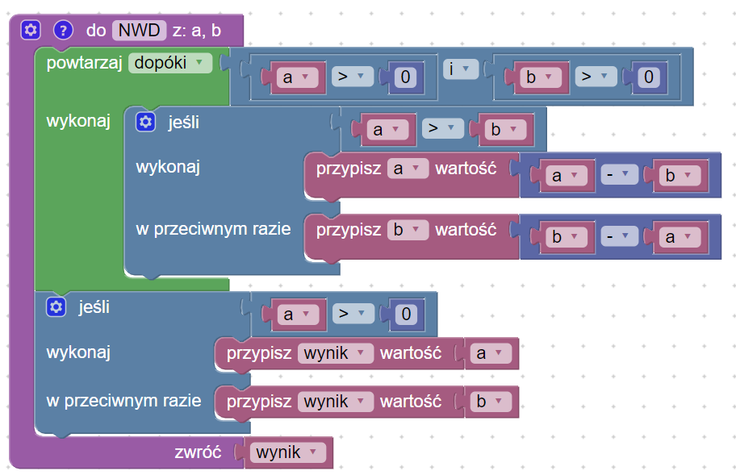
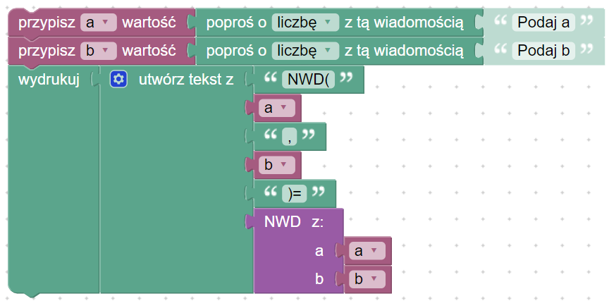
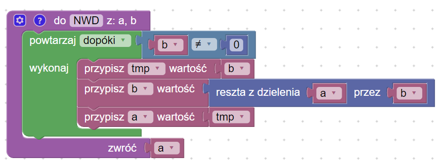
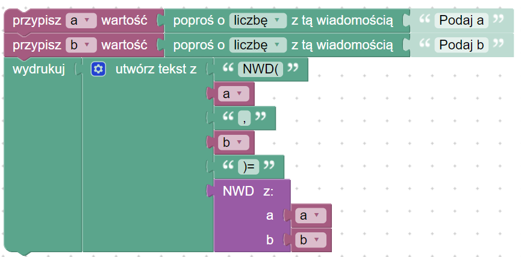
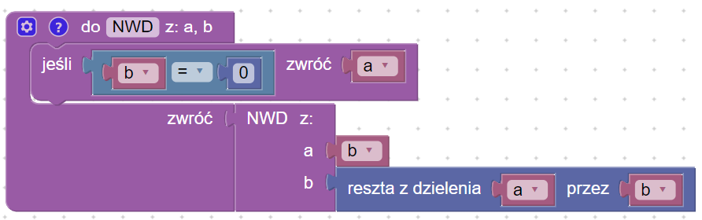
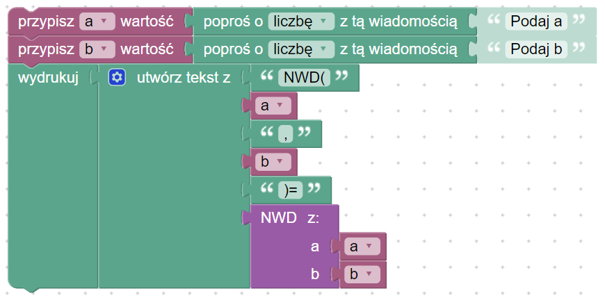

# GCD

## Problem description


[gcd.md](../../../../algorithms/integers/gcd.md)


## GCD with subtraction

### GCD

### Kod główny

### Link do implementacja


NWD z odejmowaniem


## Algorytm Euklidesa (NWD z modulo) - wersja iteracyjna

### GCD

### Kod główny

### Link do implementacji


Algorytm Euklidesa - wersja iteracyjna


## Algorytm Euklidesa (NWD z modulo) - wersja rekurencyjna

### GCD

### Kod główny

### Link do implementacji


Algorytm Euklidesa - wersja rekurencyjna

