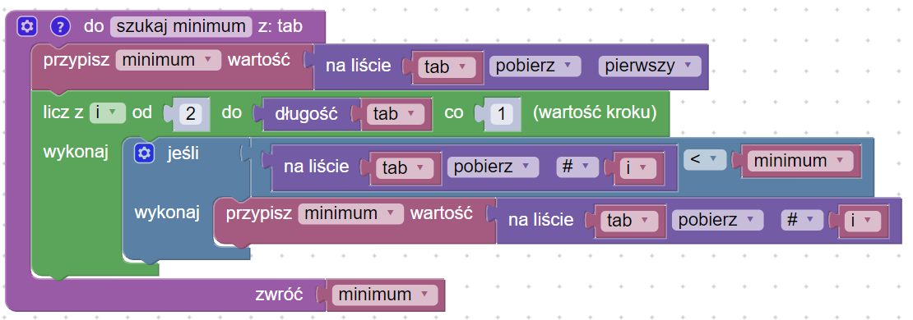
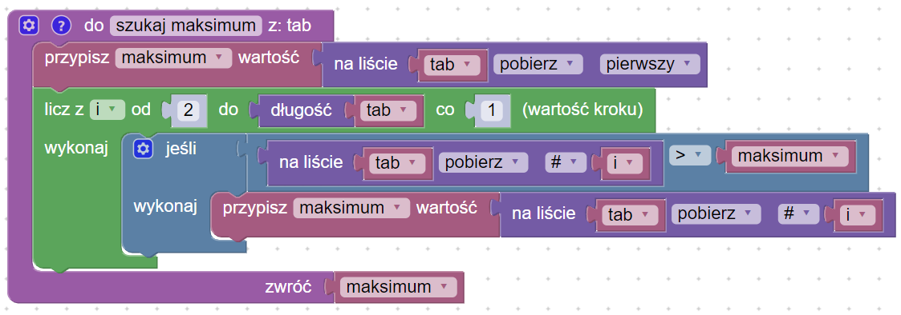

# Wyszukiwanie minimum i maksimum

## Problem description


[wyszukiwanie-maksimum.md](../../../../algorithms/searching/wyszukiwanie-maksimum.md)


## Implementation

### Znajdowanie minimum

### Znajdowanie maksimum

### Kod główny

### Link do implementacji


Znajdowanie minimum i maksimum

