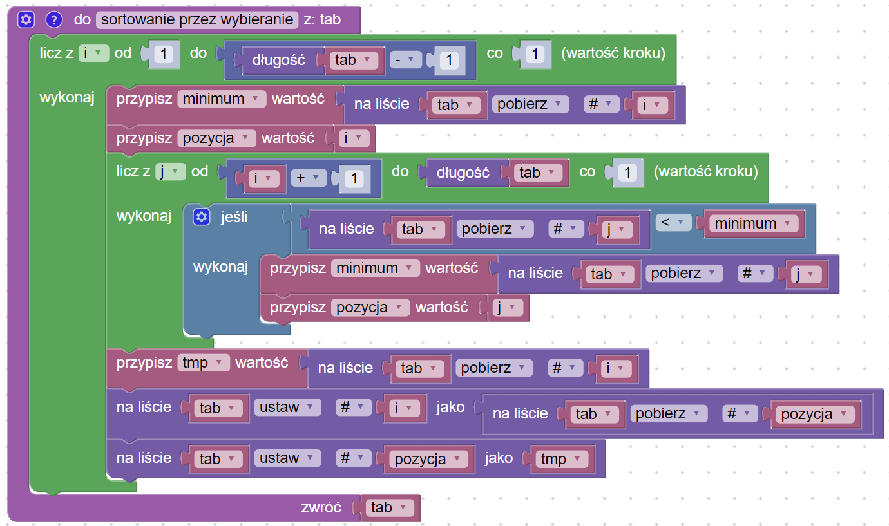

# Selection sort

## Opis problemu


[selection-sort.md](../../../../algorithms/sorting/selection-sort.md)


## Implementation

### Sortowanie

### Kod główny

### Link do implementacji


Counting sort

