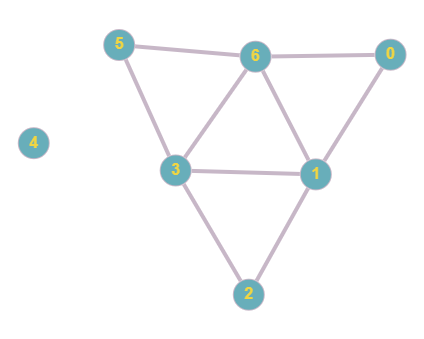

# Connected components

## Problem description


[connected-components.md](../../../../algorithms/graphs/connected-components.md)


## Implementation


```cpp
#include <iostream>
#include <vector>

using namespace std;

void dfs(vector<vector<int> > &graph, vector<bool> &visited, int node) {
    if (visited[node]) {
        return;
    }

    visited[node] = true;
    
    for (int i = 0; i < graph[node].size(); i++) {
        int nextNode = graph[node][i];
        if (!visited[nextNode]) {
            dfs(graph, visited, nextNode);
        }
    }
}

int countConnectedComponents(vector<vector<int> > &graph) {
    int result = 0;
    vector<bool> visited = vector<bool>(graph.size(), false);
    
    for (int i = 0; i < graph.size(); i++) {
        if (!visited[i]) {
            result++;
            dfs(graph, visited, i);
        }
    }

    return result;
}

int main() {
    vector<vector<int> > graph = {
		{1, 6}, 
		{0, 6, 3, 2},
		{1, 3},
		{2, 1, 6, 5},
		{},
		{3, 6},
		{0, 1, 3, 5},
	};
	
	int connectedComponentsCount = countConnectedComponents(graph);

    cout << "Number of connected components in the graph: " << connectedComponentsCount << endl;

    return 0;
}
```


### Link do implementacji


Zliczanie liczby spójnych składowych w grafie nieskierowanym


### Implementation description



